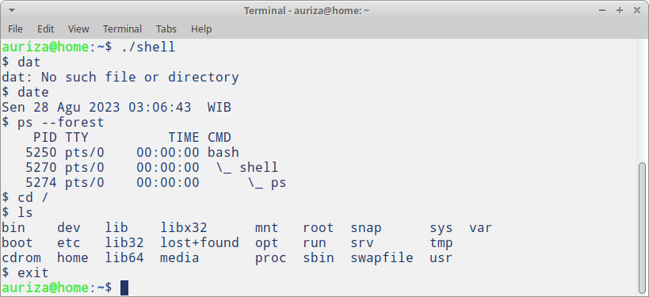

# Shell

## Cara Kerja Shell

1. Baca masukan perintah dari pengguna
2. Pisahkan perintah per argumen (per kata)
3. Buat proses *child* (`fork`)
4. Jalankan perintah (`exec`)
5. Tunggu sampai *child* selesai (`wait`)
6. Kembali ke nomor 1

## Membuat Proses Baru

\


# Tugas

## UNIX Shell

- Lihat **Project 1**[^04-shell], kerjakan **Part I**, yaitu membuat *shell*
    - templat program: <https://git.io/vycRv>
- Penilaian langsung di tempat oleh asisten praktikum
- Kumpulkan hasil akhirnya di LMS dengan nama *file* `[NIM].c`

[^04-shell]: Silberschatz *et al.* (2018), *Operating System Concepts*, hlm P12--15

<!--
- Tugas kelompok 4 orang
- Presentasi pekan depan
    - penjelasan kode program
    - demo uji coba program
-->

## Testcase

Testcase terdiri atas 6 perintah berikut. Jalankan dan bandingkan dengan contoh keluaran berikut.

```
dat
date
ps --forest
cd /
ls
exit
```

## Penilaian

{width=70%}

Nilai akan dikurangi `-10` untuk tiap keluaran perintah yang berbeda dengan contoh di atas.

**Catatan**: nilai PID dan waktu akan bervariasi sesuai kondisi.

## Debugging

Penyebab kesalahan karena:

- ada zombie process
- parameter perintah tidak berfungsi
- tidak ada fitur `cd`
- tidak ada fitur `exit`

<!--

## UNIX Shell: Fitur History (Bonus)

- Lanjutkan **Part II**, yaitu membuat fitur *history*
    - **opsional**, bonus nilai
    - plagiasi akan mendapat sanksi nilai $-100$
- Kumpulkan di LMS dengan nama *file* `[NIM].c`
    - paling lambat besok pukul 22:00
-->
