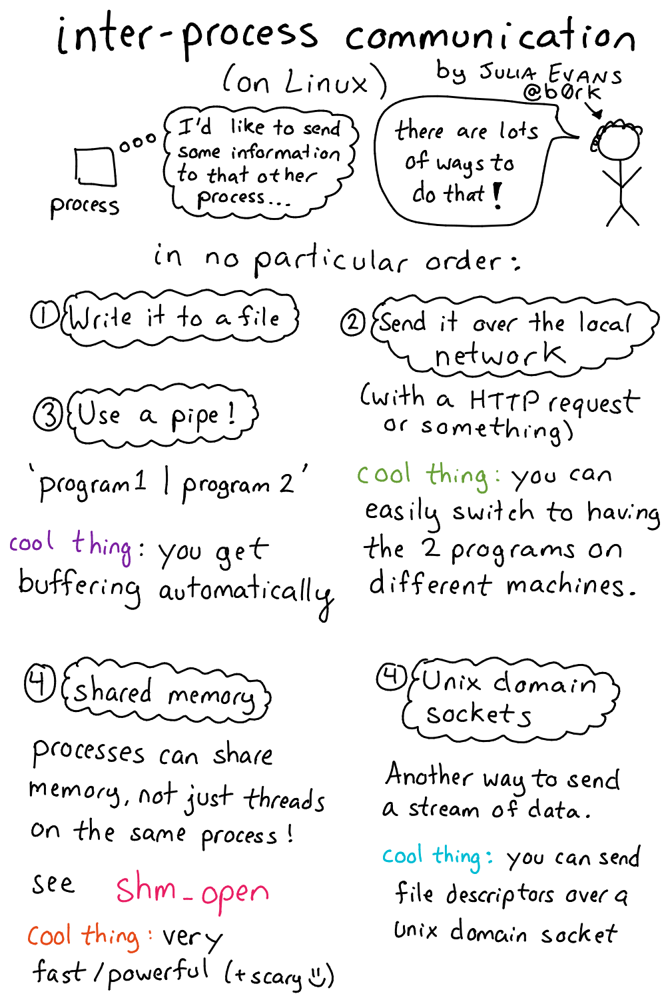
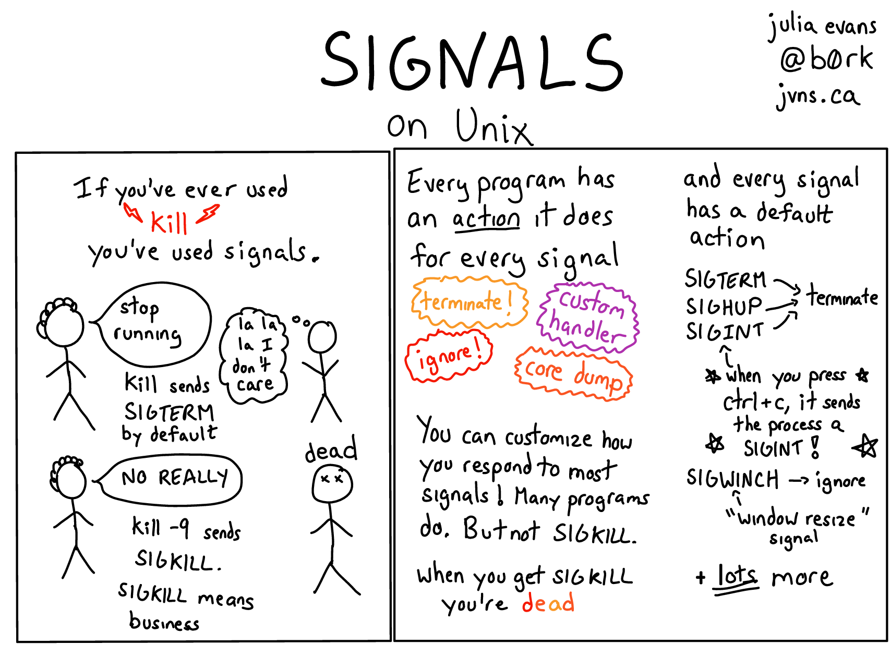

## Sinyal

- Bentuk komunikasi antarproses (IPC) yang paling sederhana.

- Contoh IPC yang lain[^ipc]:
    - *pipe*
    - *socket*
    - *shared memory*
    - *message passing*

[^ipc]: Silberschatz *et al.* (2013), *Operating System Concepts*, hlm 130--147.

---

## Jenis sinyal

- Ada 31 jenis sinyal standar[^signum].

- Beberapa sinyal dapat dikirim langsung oleh *user* ke proses *foreground* dengan menekan kombinasi tombol berikut:
    - `Ctrl-C`: sinyal *interrupt* (`SIGINT`)
    - `Ctrl-Z`: sinyal *terminal stop* (`SIGTSTP`)
    - `Ctrl-\`: sinyal *quit* (`SIGQUIT`)

[^signum]: lihat *file* `/usr/include/bits/signum.h` dan `man 7 signal`.

---

---

~~~c
#define SIGHUP      1   // Hangup.
#define SIGINT      2   // Interrupt.
#define SIGQUIT     3   // Quit.
#define SIGILL      4   // Illegal instruction.
#define SIGTRAP     5   // Trace trap.
#define SIGABRT     6   // Abort.
#define SIGBUS      7   // Bus error.
#define SIGFPE      8   // Floating-point exception.
#define SIGKILL     9   // Kill, unblockable.
#define SIGUSR1     10  // User-defined signal 1.
#define SIGSEGV     11  // Segmentation violation.
#define SIGUSR2     12  // User-defined signal 2.
#define SIGPIPE     13  // Broken pipe.
#define SIGALRM     14  // Alarm clock.
#define SIGTERM     15  // Termination.
#define SIGSTKFLT   16  // Stack fault.
~~~

---

~~~c
#define SIGCHLD     17  // Child status has changed.
#define SIGCONT     18  // Continue.
#define SIGSTOP     19  // Stop, unblockable.
#define SIGTSTP     20  // Keyboard stop.
#define SIGTTIN     21  // Background read from tty.
#define SIGTTOU     22  // Background write to tty.
#define SIGURG      23  // Urgent condition on socket.
#define SIGXCPU     24  // CPU limit exceeded.
#define SIGXFSZ     25  // File size limit exceeded.
#define SIGVTALRM   26  // Virtual alarm clock.
#define SIGPROF     27  // Profiling alarm clock.
#define SIGWINCH    28  // Window size change.
#define SIGIO       29  // I/O now possible.
#define SIGPWR      30  // Power failure restart.
#define SIGSYS      31  // Bad system call.
~~~

# `signal()`

## Fungsi `signal()`

`void signal(int signum, void function(int));`{.c}

- Untuk menangani sinyal yang masuk[^signal].

- Jika ada `signum` yang masuk, maka `function` akan dijalankan.

[^signal]: lihat `man 2 signal`.

## Contoh

~~~c
void foo(int sig) {
    printf("got signal %d\n", sig); // print signum
    signal(SIGINT, SIG_DFL);        // back to default
}

int main() {
    signal(SIGINT, foo);
    while (1) {
        puts("hello");
        sleep(1);
    }
}
~~~

## Penjelasan

- Jalankan program, kemudian kirim `SIGINT` (tekan `Ctrl-C`).

- Karena ada `SIGINT` masuk, program memanggil fungsi `foo`.

- Kirim lagi `SIGINT`.

- Apa yang terjadi? Mengapa demikian?

- Apa maksud `SIG_DFL`?

# `kill()`

## Fungsi `kill()`

`int kill(pid_t pid, int signum);`{.c}

- Untuk mengirim sinyal `signum` ke proses `pid`[^kill].

[^kill]: lihat `man 2 kill`.

## Contoh

\label{kill}

~~~c
int main()
{
    pid_t child = fork();
    if (child == 0) {
        while (1) {
            puts("child");
            sleep(1);
        }
    } else {
        sleep(5);
        kill(child, SIGTERM);   // terminate
    }
    return 0;
}
~~~

## Penjelasan

- *Child* akan terus mencetak tiap 1 detik.

- Setelah 5 detik, *parent* mengirim `SIGTERM` ke *child*.

- *Child* akan berhenti karena mendapat `SIGTERM` dari *parent*.

# `pause()`

## Fungsi `pause()`

`int pause(void);`{.c}

- Untuk menunggu sinyal masuk[^pause].

[^pause]: lihat `'man 2 pause'`.

## Contoh

~~~c
void ding(int sig) { puts("ding!"); }

int main()
{
    if (fork() == 0) {
        sleep(5);
        kill(getppid(), SIGALRM);
    } else {
        signal(SIGALRM, ding);
        puts("waiting...");
        pause();
    }
    return 0;
}
~~~

## Penjelasan

- *Parent* menunggu sinyal masuk.

- *Child* akan mengirim `SIGALRM` ke *parent* setelah 5 detik.

- Setelah `SIGALRM` masuk, *parent* memanggil fungsi `ding`.

- Apa yang terjadi jika *parent* tidak memanggil fungsi `pause()`?

## Tugas

- Modifikasi program contoh hlm \ref{kill} pada bagian *parent*, sehingga *child* akan:
    - berjalan selama 4 detik, lalu
    - berhenti sementara (*stop*) selama 3 detik, lalu
    - lanjut lagi berjalan (*continue*) selama 2 detik, lalu
    - berhenti (*terminate*)

- Jika benar, *child* akan mencetak 6 kali.

- Kumpulkan di LMS berupa satu *file* dengan nama `[NIM].c`.

## Tugas Bonus

- Implementasikan sendiri fungsi `system()` anda sesuai penjelasan yang tertera pada manual[^system].
    - gunakan fungsi `fork()`, `execl()`, `wait()`, dan `signal()`
    - coba jalankan beberapa perintah memakai fungsi tsb

- Kumpulkan di LMS berupa satu *file* dengan nama `[NIM].c`.
    - **opsional**, plagiasi akan mendapat sanksi nilai $-100$
    - paling lambat besok pukul 06:00

[^system]: lihat `man 3 system`.
