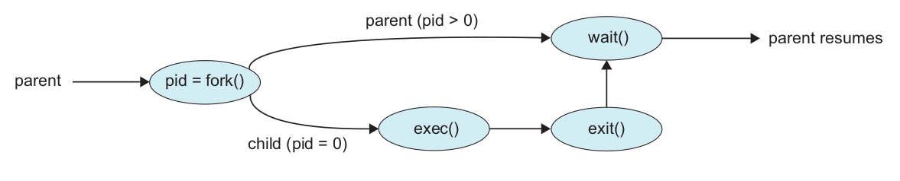

# Shell

## Cara Kerja Shell

1. Baca masukan perintah dari pengguna
2. Pisahkan perintah per argumen (per kata)
3. Buat proses *child* (`fork`)
4. Jalankan perintah (`exec`)
5. Tunggu sampai *child* selesai (`wait`)
6. Kembali ke nomor 1

## Membuat Proses Baru

\

# Tugas

## UNIX Shell

- Lihat **Project 1**[^04-shell], kerjakan **Part I**, yaitu membuat *shell*
    - lengkapi contoh program berikut[^04-shc]
- Kumpulkan di LMS dengan nama *file* `NIM_shell.c`
    - paling lambat setelah praktikum berakhir

[^04-shell]: Silberschatz *et al.* (2013), *Operating System Concepts*, hlm 157--159
[^04-shc]: <https://git.io/vycRv>

## History Feature

- Lanjutkan **Part II**, yaitu membuat fitur *history*
    - **opsional**, bonus nilai
    - plagiasi akan mendapat sanksi nilai -100
- Kumpulkan di LMS dengan nama *file* `NIM_shellhist.c`
    - paling lambat besok pukul 06:00
