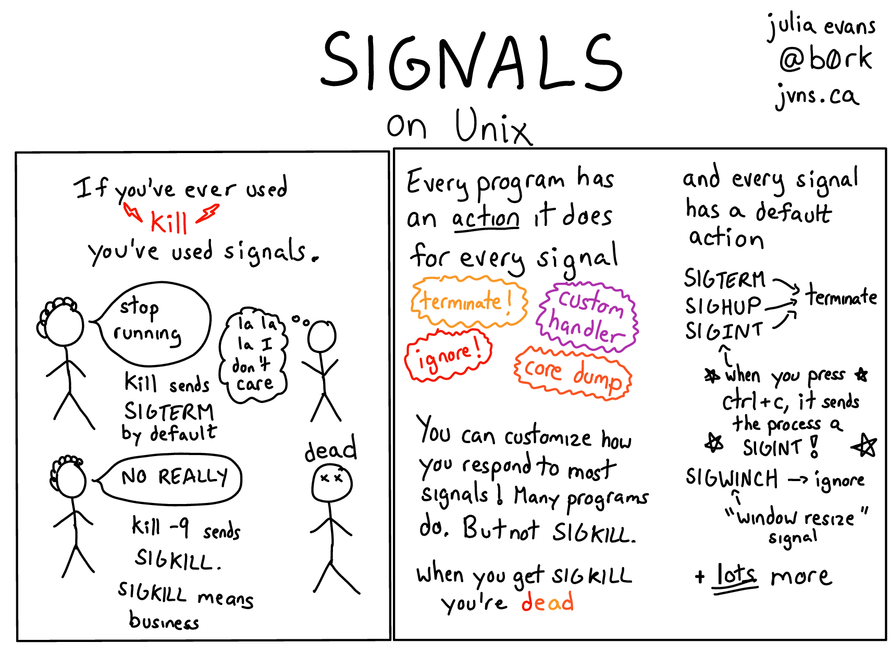

## Sinyal

- Bentuk komunikasi antarproses (IPC) yang paling sederhana.

- Contoh IPC yang lain[^03-ipc]:
    - *pipe*
    - *shared memory*
    - *message passing*
    - *socket*

[^03-ipc]: Silberschatz *et al.* (2013), *Operating System Concepts*, hlm 130--147.

---


## Jenis sinyal

- Ada 31 jenis sinyal standar[^03-signum].

- Berikut sinyal yang dapat dikirim oleh *user* ke proses:
    - `Ctrl-C`: sinyal *interrupt* (`SIGINT`)
    - `Ctrl-Z`: sinyal *terminal stop* (`SIGTSTP`)
    - `Ctrl-\`: sinyal *quit* (`SIGQUIT`)

[^03-signum]: lihat *file* `/usr/include/bits/signum-generic.h`.

---



---

~~~c
#define SIGHUP      1   // hangup
#define SIGINT      2   // interrupt
#define SIGQUIT     3   // quit
#define SIGILL      4   // illegal instruction
#define SIGTRAP     5   // trace trap
#define SIGABRT     6   // abort
#define SIGBUS      7   // bus error
#define SIGFPE      8   // floating-point exception
#define SIGKILL     9   // kill, unblockable
#define SIGUSR1     10  // user-defined signal 1
#define SIGSEGV     11  // segmentation violation
#define SIGUSR2     12  // user-defined signal 2
#define SIGPIPE     13  // broken pipe
#define SIGALRM     14  // alarm clock
#define SIGTERM     15  // termination
~~~

---

~~~c
#define SIGSTKFLT   16  // stack fault
#define SIGCHLD     17  // child terminated/stopped
#define SIGCONT     18  // continue
#define SIGSTOP     19  // stop, unblockable
#define SIGTSTP     20  // keyboard stop
#define SIGTTIN     21  // background read from tty
#define SIGTTOU     22  // background write to tty
#define SIGURG      23  // urgent data on socket
#define SIGXCPU     24  // CPU time limit exceeded
#define SIGXFSZ     25  // file size limit exceeded
#define SIGVTALRM   26  // virtual timer expired
#define SIGPROF     27  // profiling timer expired
#define SIGWINCH    28  // window size change
#define SIGPOLL     29  // pollable event occured
#define SIGPWR      30  // power failure imminent
#define SIGSYS      31  // bad system call
~~~


# `signal()`

## Fungsi `signal()`

`void signal(int signum, void function(int));`{.c}

- Untuk menangani sinyal yang masuk[^03-signal].

- Jika ada `signum` yang masuk, maka `function` akan dijalankan.

[^03-signal]: lihat `man 2 signal`.


## Contoh

~~~c
void foo(int sig) {
    printf("got signal %d\n", sig); // print signum
    signal(SIGINT, SIG_DFL);        // back to default
}

int main() {
    signal(SIGINT, foo);
    while (1) {
        puts("hello");
        sleep(1);
    }
}
~~~

## Penjelasan

- Jalankan program, kemudian kirim `SIGINT` (tekan `Ctrl-C`).

- Karena ada `SIGINT` masuk, program memanggil fungsi `foo`.

- Kirim lagi `SIGINT`.

- Apa yang terjadi? Mengapa demikian?

- Apa maksud `SIG_DFL`?


# `kill()`

## Fungsi `kill()`

`int kill(pid_t pid, int signum);`{.c}

- Untuk mengirim sinyal `signum` ke proses `pid`[^03-kill].

[^03-kill]: lihat `man 2 kill`.

## Contoh

\label{kill}

~~~c
int main()
{
    pid_t child = fork();
    if (child == 0) {
        while (1) {
            puts("child");
            sleep(1);
        }
    } else {
        sleep(5);
        kill(child, SIGTERM);   // terminate
    }
    return 0;
}
~~~

## Penjelasan

- *Child* akan terus mencetak tiap 1 detik.

- Setelah 5 detik, *parent* mengirim `SIGTERM` ke *child*.

- *Child* akan berhenti karena mendapat `SIGTERM` dari *parent*.


# `pause()`

## Fungsi `pause()`

`int pause(void);`{.c}

- Untuk menunggu sampai ada sinyal yang masuk[^03-pause].

[^03-pause]: lihat `'man 2 pause'`.

## Contoh

~~~c
void ding(int sig) { puts("ding!"); }

int main()
{
    if (fork() == 0) {
        sleep(5);
        kill(getppid(), SIGALRM);
    } else {
        signal(SIGALRM, ding);
        puts("waiting...");
        pause();
    }
    return 0;
}
~~~

## Penjelasan

- *Parent* menunggu sinyal masuk.

- *Child* akan mengirim `SIGALRM` ke *parent* setelah 5 detik.

- Setelah `SIGALRM` masuk, *parent* memanggil fungsi `ding`.

- Apa yang terjadi jika *parent* tidak memanggil fungsi `pause()`?


# Tugas

## Kirim Sinyal

- Modifikasi program contoh (hlm \ref{kill}) pada bagian *parent*, sehingga *child* akan:
    - berjalan selama 4 detik, lalu
    - berhenti sementara selama 3 detik, lalu
    - lanjut lagi berjalan selama 2 detik, lalu
    - berhenti
- Jika benar, *child* akan mencetak 4 kali, jeda, dan 2 kali.
    - tunjukkan ke asprak untuk dinilai

<!--

## Implementasi Fungsi `system()` (Bonus)

- Implementasikan sendiri fungsi `system()` anda sesuai penjelasan yang tertera pada manual[^03-system].
    - gunakan fungsi `fork()`, `execl()`, `wait()`, dan `signal()`
    - coba jalankan beberapa perintah memakai fungsi tsb
- Kumpulkan di LMS berupa satu *file* dengan nama `[NIM].c`.
    - **opsional**, plagiasi akan mendapat sanksi nilai $-100$
    - paling lambat besok pukul 22:00

[^03-system]: lihat `man 3 system`.

---

```c
#include <unistd.h>
#include <signal.h>
#include <sys/wait.h>

int _system(const char *cmd) {
    /* TODO: implement system() function */
    return 0;
}

int main() {
    _system("cal -3");
    return 0;
}
```

-->
