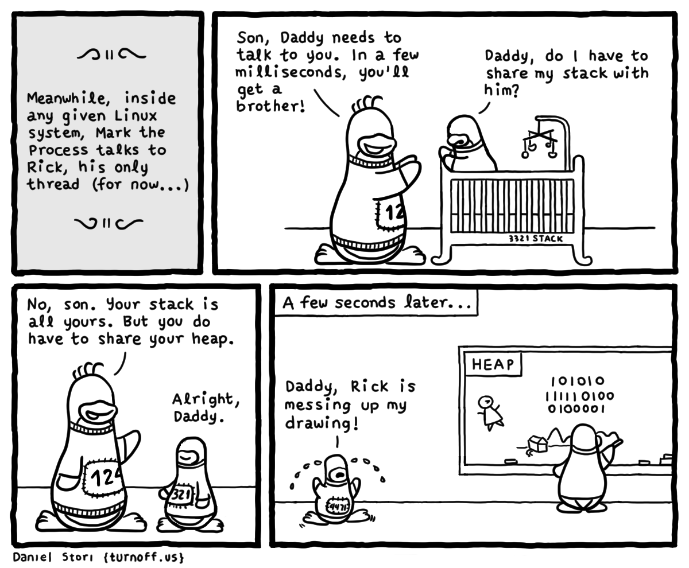

# Thread

## Thread

- *thread* adalah satuan dasar utilisasi CPU[^05-thread]
- tiap *thread* memiliki:
    - id, *program counter*, *register set*, dan *stack*
- dalam satu proses, *thread* berbagi:
    - segmen teks, data, dan *heap*, serta sumberdaya lain (mis. *file*)
- proses *multithreaded* memiliki beberapa *thread* yang dapat mengerjakan
    beberapa tugas secara bersamaan

[^05-thread]: Silberschatz *et al.* (2013), *Operating System Concepts*, hlm 163.

---

---

## POSIX Thread

- Linux memakai *thread* standar POSIX[^05-posix] (`pthread`)
- saat kompilasi tambahkan *flag* `-pthread`

[^05-posix]: The Portable Operating System Interface

## Membuat Thread

`pthread_create(thread, attr, func, arg);`{.c}

- membuat satu `thread` dengan atribut `attr` yang akan menjalankan fungsi `func`
    dengan argumen `arg`[^05-create]
- deklarasi fungsi tersebut:
    - `void *func(void *arg);`{.c}[^05-void]

[^05-create]: lihat`'man pthread_create'`
[^05-void]: `void*`: tipe data *generic pointer*

## Menunggu Thread

`pthread_join(thread, retval);`{.c}

- menunggu `thread` selesai dan menyimpan keluarannya ke variabel `retval`[^05-join]

[^05-join]: lihat`'man pthread_join'`

## Mengakhiri Thread

`pthread_exit(retval);`{.c}

- mengakhiri *thread* dengan nilai keluaran `retval`[^05-exit]

[^05-exit]: lihat`'man pthread_exit'`

# Contoh

## Satu Thread

~~~c
#include <stdio.h>
#include <pthread.h>

void *hello(void *arg) {
    puts("hello");
    pthread_exit(NULL);
}

int main() {
    pthread_t t;
    pthread_create(&t, NULL, hello, NULL);
    pthread_join(t, NULL);
    return 0;
}
~~~

## Dua Thread

~~~c
...

int main() {
    pthread_t t1, t2;

    pthread_create(&t1, NULL, hello, NULL);
    pthread_create(&t2, NULL, hello, NULL);
    pthread_join(t1, NULL);
    pthread_join(t2, NULL);

    return 0;
}
~~~

## *N* Thread

~~~c
...

#define N 8

int main() {
    pthread_t t[N];

    for (int i = 0; i < N; i++)
        pthread_create(&t[i], NULL, hello, NULL);
    for (int i = 0; i < N; i++)
        pthread_join(t[i], NULL);

    return 0;
}
~~~

# Contoh Argumen

## Satu Thread dengan Argumen

~~~c
#include <stdio.h>
#include <pthread.h>

void* hello(void* arg) {
    printf("hello from thread %d\n", ((int*)arg)[0]);
    pthread_exit(NULL);
}

int main() {
    pthread_t t;
    pthread_create(&t, NULL, hello, &(int){42});
    pthread_join(t, NULL);
    return 0;
}
~~~

## Dua Thread dengan Argumen

~~~c
...

int main() {
    pthread_t t1, t2;
    int id[] = {10, 20};

    pthread_create(&t1, NULL, hello, &id[0]);
    pthread_create(&t2, NULL, hello, &id[1]);
    pthread_join(t1, NULL);
    pthread_join(t2, NULL);

    return 0;
}
~~~

## *N* Thread dengan Argumen

~~~c
...
#define N 8

int main() {
    pthread_t t[N];
    int id[N] = {0, 1, 2, 3, 4, 5, 6, 7};

    for (int i = 0; i < N; i++)
        pthread_create(&t[i], NULL, hello, &id[i]);
    for (int i = 0; i < N; i++)
        pthread_join(t[i], NULL);

    return 0;
}
~~~

# Latihan

## Jumlah Array

- lengkapi program berikut untuk menjumlahkan *array* `A`
- gunakan variabel global `sum` untuk menyimpan hasilnya

    ~~~c
    #include <stdio.h>
    #define N 16

    int sum = 0;

    int main() {
        int A[N] = {68,34,64,95,35,78,65,93,
                    51,67, 7,77, 4,73,52,91};
        /* TODO: array sum                  */
        printf("%d\n", sum);    /* 954      */
        return 0;
    }
    ~~~

## Jumlah Array (Satu Thread)

- sekarang, buat satu buah *thread* untuk menjumlahkan nilai semua elemen *array* `A` dengan fungsi `array_sum()`
- *thread* utama hanya membuat dan menunggu *thread* ini selesai

## Jumlah Array (Dua Thread)

- oke?
- sekarang gunakan 2 buah *thread* untuk menjumlahkan nilai semua elemen *array* A
- pastikan pembagian kerja antara kedua *thread* seimbang, yaitu tiap *thread* memproses $\frac{N}{2}$ elemen

## Jumlah Array (Empat Thread)

- bisa?
- sekarang gunakan 4 buah *thread* untuk menjumlahkan nilai semua elemen *array* A
- pastikan pembagian kerja antara keempat *thread* seimbang, yaitu tiap *thread* memproses $\frac{N}{4}$ elemen
- kumpulkan di LMS paling lambat hingga praktikum berakhir
<!-- - tunjukkan ke asprak untuk dinilai -->

## Penilaian

- `+60`: keluaran benar: `954`
- `+20`: jumlah *syscall* `clone`[^clone] ada 4
- `+20`: variabel *array* A lokal di fungsi utama
- `-20`: pemanggilan fungsi `pthread` tanpa *looping*

[^clone]: cek dengan perintah `'strace -ce clone ./program'`

<!--

~~~c
#include <stdio.h>
#include <pthread.h>

#define N 16
#define T 4

int sum = 0;

void *array_sum(void *arg)
{
    int *array = (int*)arg;     // cast void* -> int*
    int i;

    for (i = 0; i < N/T; i++)
        sum += array[i];

    pthread_exit(NULL);
}

int main()
{
    pthread_t t[T];
    int A[N] = {68,34,64,95,35,78,65,93,51,67,7,77,4,73,52,91};
    int i;

    for (i = 0; i < T; i++)
        pthread_create(&t[i], NULL, array_sum, &A[i * N/T]);

    for (i = 0; i < T; i++)
        pthread_join(t[i], NULL);

    printf("%d\n", sum);
    return 0;
}
~~~

-->
