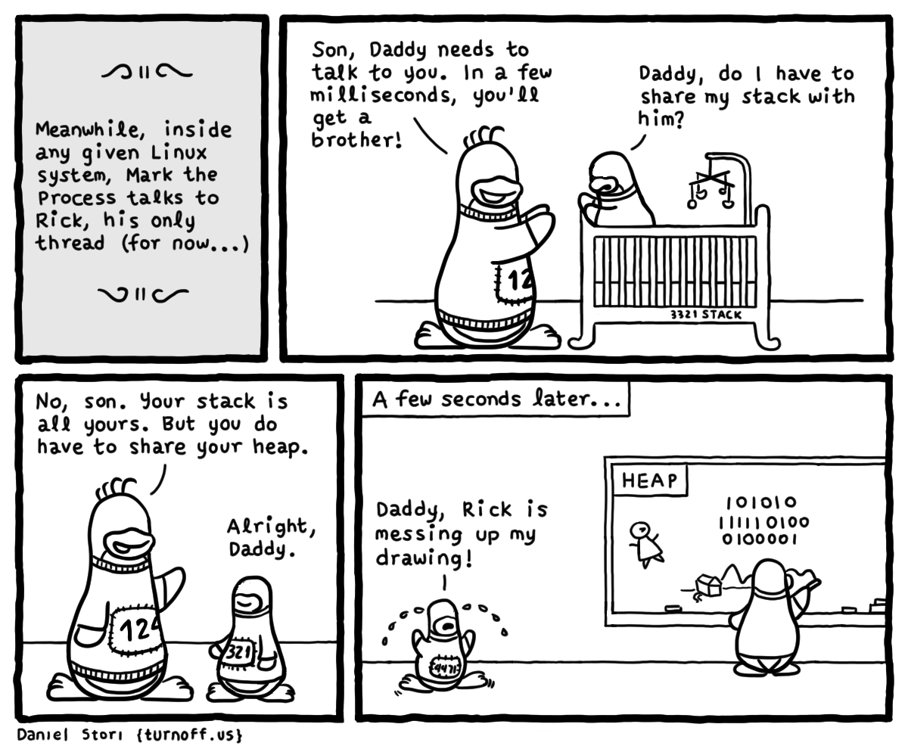

# Critical Section

## Critical Section

> A **critical section** is a section of code that can be executed by at most **one process at a time**.
> The critical section exists to protect shared resources from multiple access.[^06-critsec]

- contoh: mengubah variabel global, menulis ke *file*, dll.
- solusi: sinkronisasi

[^06-critsec]: Jones (2008), *GNU/Linux Application Programming*, hlm 264.

## Sinkronisasi

- untuk melindungi (mengunci) sebuah *critical section*
    - hanya satu proses/*thread* dalam satu waktu yang dapat masuk
- menggunakan *mutex lock* atau *semaphore*

---

# Mutual Exclusion

## Mutex

> Mutex is a key to a variable.
> One thread can have the key---modify the variable---at the time.
> When finished, the thread gives (frees) the key to the next thread in the group.[^06-mutex]

[^06-mutex]: <http://koti.mbnet.fi/niclasw/MutexSemaphore.html>

## Fungsi Mutex

~~~c
#include <pthread.h>

int pthread_mutex_init(pthread_mutex_t *mutex,
                       const pthread_mutexattr_t *attr);
int pthread_mutex_lock(pthread_mutex_t *mutex));
int pthread_mutex_unlock(pthread_mutex_t *mutex);
int pthread_mutex_destroy(pthread_mutex_t *mutex);
~~~

- `init`: inisialisasi `mutex`
- `lock`: mengunci *critical section*
- `unlock`: melepaskan kunci *critical section*
- `destroy`: menghapus `mutex`

## Latihan

Apa yang salah dengan kode berikut ini? Perbaiki dengan menggunakan *mutex*!

~~~c
// counting to one million
#include <stdio.h>
#include <pthread.h>

#define N 1000000
#define T 4

int count = 0;
~~~

---

~~~c
void *counting(void *arg)
{
    int i;
    for (i = 0; i < N/T; i++)
        count++;        // critical section

    pthread_exit(NULL);
}
~~~

---

~~~c
int main()
{
    pthread_t t[T];
    int i;

    for (i = 0; i < T; i++)
        pthread_create(&t[i], NULL, counting, NULL);

    for (i = 0; i < T; i++)
        pthread_join(t[i], NULL);

    printf("%d\n", count);      // 1000000, no?
    return 0;
}
~~~

# Semaphore

## Semaphore

- nilai *semaphore* `S` diinisialisasi dengan bilangan non-negatif
- terdapat dua operasi atomik yang bisa dilakukan pada *semaphore*, yaitu `wait` dan `post`[^06-sem]

    ~~~c
    wait(S) {
        while (S == 0)
            ; // busy wait
        S--;

    post(S) {
        S++;
    }
    ~~~

[^06-sem]: Silberschatz *et al.* (2013), *Operating System Concepts*, hlm 214.

## Jenis Semaphore

1. *Counting semaphore*, nilai awal *semaphore* lebih dari 1
2. *Binary semaphore*, nilai awal *semaphore* adalah 1 (sama fungsinya dengan *mutex*)

## Fungsi Semaphore

~~~c
#include <semaphore.h>

int sem_init(sem_t *sem, int pshared, unsigned int value);
int sem_wait(sem_t *sem);
int sem_post(sem_t *sem);
int sem_destroy(sem_t *sem);
~~~

- `init`: inisialisasi `sem` dengan nilai awal `value`
- `wait`:
    - jika `sem = 0` &rarr; *block*
    - jika `sem > 0` &rarr; `sem--`, *continue*
- `post`: `sem++`
- `destroy`: menghapus `sem`

## Latihan

Perbaiki latihan sebelumnya dengan menggunakan *semaphore*!

# Tugas

## Array Sum

Identifikasi *critical section* dan perbaiki kode berikut ini supaya hasilnya benar.

~~~c
#include <stdio.h>
#include <pthread.h>
#include <stdlib.h>

#define N 100000
#define T 4

int sum = 0;
~~~

---

~~~c
void *array_sum(void *arg)
{
    int *array = (int*)arg;     // cast void* --> int*
    int i;

    for (i = 0; i < N/T; i++)
        sum += array[i];

    pthread_exit(NULL);
}
~~~

---

~~~c
int main()
{
    pthread_t t[T];
    int A[N], i;

    for (i = 0; i < N; i++)
        A[i] = rand()%10;

    for (i = 0; i < T; i++)
        pthread_create(&t[i], NULL, array_sum, &A[i*N/T]);

    for (i = 0; i < T; i++)
        pthread_join(t[i], NULL);

    printf("%d\n", sum);    // 448706
    return 0;
}
~~~
