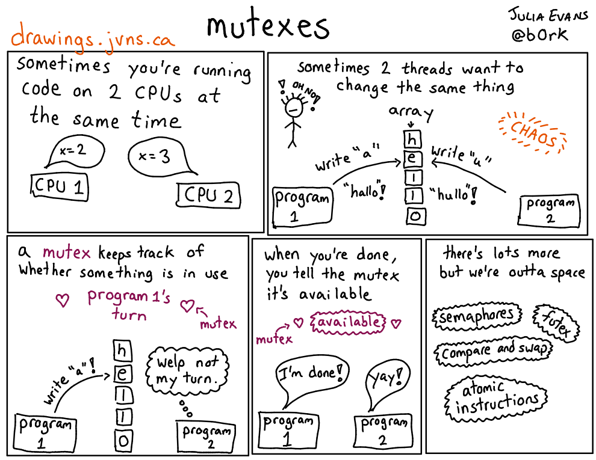

# Critical Section

## Critical Section

> A **critical section** is a section of code that can be executed by at most **one thread at a time**.
> The critical section exists to protect shared resources from multiple access.[^06-critsec]

- contoh:
    - mengubah variabel global
    - mengubah *database*
    - menulis ke *file*
- proteksi dengan sinkronisasi

[^06-critsec]: Jones (2008), *GNU/Linux Application Programming*, hlm 264.


## Sinkronisasi

- melindungi (mengunci) sebuah *critical section*
    - hanya satu *thread* dalam satu waktu yang dapat masuk
- implementasi:
    - *mutex lock*
    - *semaphore*


# Mutual Exclusion

## Mutex

> Mutex is a **key** to a variable.
> One thread can have the key---modify the variable---at the time.
> When finished, the thread gives (frees) the key to the next thread in the group.[^06-mutex]

[^06-mutex]: <http://koti.mbnet.fi/niclasw/MutexSemaphore.html>

---




## Fungsi Mutex

\small

~~~c
#include <pthread.h>

pthread_mutex_t mutex;

pthread_mutex_init(&mutex, &attr);
pthread_mutex_lock(&mutex);
pthread_mutex_unlock(&mutex);
pthread_mutex_destroy(&mutex);
~~~

\normalsize

- `init`: inisialisasi `mutex`
    - `attr` *default* isi dengan `NULL`
- `lock`: mendapatkan kunci *critical section*
- `unlock`: melepas kunci *critical section*
- `destroy`: menghapus `mutex`

## Latihan

Apa yang salah dengan kode berikut ini? Perbaiki dengan menggunakan *mutex*!

---

\scriptsize

~~~c
// counting to one million
#include <stdio.h>
#include <pthread.h>

#define N 1000000
#define T 4

int count = 0;

void *counting(void *arg)
{
    int i;
    for (i = 0; i < N/T; i++)
        count++;        // critical section

    pthread_exit(NULL);
}
~~~

---

\scriptsize

~~~c
int main()
{
    pthread_t t[T];
    int i;

    for (i = 0; i < T; i++)
        pthread_create(&t[i], NULL, counting, NULL);

    for (i = 0; i < T; i++)
        pthread_join(t[i], NULL);

    printf("%d\n", count);      // 1000000, no?
    return 0;
}
~~~

# Semaphore

## Semaphore

- nilai *semaphore* `S`: bilangan non-negatif
- terdapat dua operasi atomik yang bisa dilakukan pada *semaphore*, yaitu `wait` dan `post`[^06-sem]

\small

~~~c
wait(S) {
    while (S == 0)
        ; // busy wait
    S--;
}

post(S) {
    S++;
}
~~~

[^06-sem]: Silberschatz *et al.* (2013), *Operating System Concepts*, hlm 214.


## Jenis Semaphore

1. *Binary semaphore*
    - nilai awal *semaphore* = 1
    - sama fungsinya dengan *mutex*
2. *Counting semaphore*
    - nilai awal *semaphore* > 1

## Fungsi Semaphore

\small

~~~c
#include <semaphore.h>

sem_t sem;

sem_init(&sem, pshared, value);
sem_wait(&sem);
sem_post(&sem);
sem_destroy(&sem);
~~~

\normalsize

- `init`: inisialisasi `sem` dengan nilai awal `value`
- `wait`:
    - selama `sem = 0` &rarr; *busy wait*
    - hingga `sem > 0` &rarr; `sem--`, *continue*
- `post`: `sem++`
- `destroy`: menghapus `sem`

## Latihan

Perbaiki latihan sebelumnya dengan menggunakan *semaphore*!


# Tugas

## *Big Array Sum*

Identifikasi *critical section* dan perbaiki kode berikut ini supaya hasilnya benar.
Kumpulkan di LMS paling lambat hingga praktikum berakhir.
<!-- Tunjukkan ke asprak untuk dinilai.-->

---

\scriptsize

~~~c
#include <stdio.h>
#include <pthread.h>
#include <stdlib.h>

#define N 100000
#define T 4

int sum = 0;

void *array_sum(void *arg)
{
    int *A = (int*)arg;         // cast void* --> int*
    int i;

    for (i = 0; i < N/T; i++)
        sum += A[i];

    pthread_exit(NULL);
}
~~~

---

\scriptsize

~~~c
int main()
{
    pthread_t t[T];
    int A[N], i;

    for (i = 0; i < N; i++)
        A[i] = rand()%10;

    for (i = 0; i < T; i++)
        pthread_create(&t[i], NULL, array_sum, &A[i*N/T]);

    for (i = 0; i < T; i++)
        pthread_join(t[i], NULL);

    printf("%d\n", sum);    // 448706
    return 0;
}
~~~

## Penilaian

- `+80`: keluaran selalu benar (jalankan min 10 kali)
- `+20`: jumlah *syscall* `clone`[^clone] ada 4

[^clone]: cek dengan perintah `'strace -ce clone ./program'`

<!--

# Tugas Bonus

## Pi Approximation

$$ \pi \approx \int_0^1 \frac{4}{1+x^2} dx $$

- integrasi numerik dengan aturan *midpoint*
- lihat ilustrasinya di WolframAlpha

\tiny

<http://www.wolframalpha.com/input/?i=midpoint+rule+4%2F(1%2Bx^2)+from+0+to+1+with+5+intervals>


## Pi Approximation

- paralelkan program berikut dengan 4 *thread*
- berikan komentar bagian *critical section*
- berikan komentar pada baris teratas:
    - nama dan NIM
    - tipe prosesor
    - waktu eksekusi program *single-threaded* ($t_s$)
    - waktu eksekusi program *multithreaded* ($t_p$)
    - *speedup* ($s = \frac{t_s}{t_p}$) dan efisiensi
    - simpulan
- kumpulkan dalam satu berkas `.c`
- plagiat: nilai `-100`

---

\tiny

```c
#include <stdio.h>
#include <math.h>
#include <time.h>

int main()
{
    int             a, b;
    long long       n, i;
    long double     x, y, dx, area;
    struct timespec t1, t2;

    n  = 100000000;                     // number of intervals (rectangles)
    a  = 0;                             // integral lower limit
    b  = 1;                             // integral upper limit
    dx = (double) (b-a) / n;            // interval's width
    area = 0.0;                         // sum of midpoint area

    clock_gettime(CLOCK_REALTIME, &t1);
    for (i = 0; i < n; i++) {
        x = a + (i + 0.5) * dx;         // interval's midpoint
        y = (4.0 / (1.0 + x*x));        // interval's height -> f(x) = 4 / (1+x^2)
        area += y * dx;                 // interval's area
    }
    clock_gettime(CLOCK_REALTIME, &t2);

    printf("   Pi: % .16Lf\n", area);
    printf("Error: % .16Lf\n", area - M_PI);
    printf(" Time: % .3fs\n", (t2.tv_sec - t1.tv_sec) + (t2.tv_nsec - t1.tv_nsec)/1e9);
    return 0;
}
```

-->
