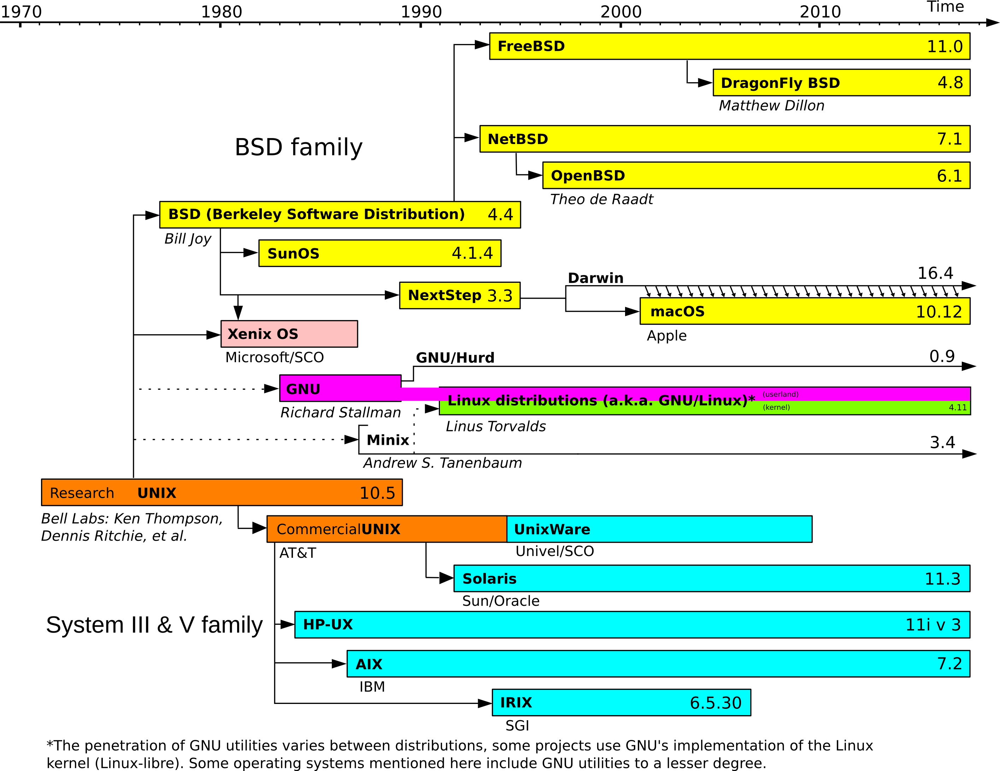
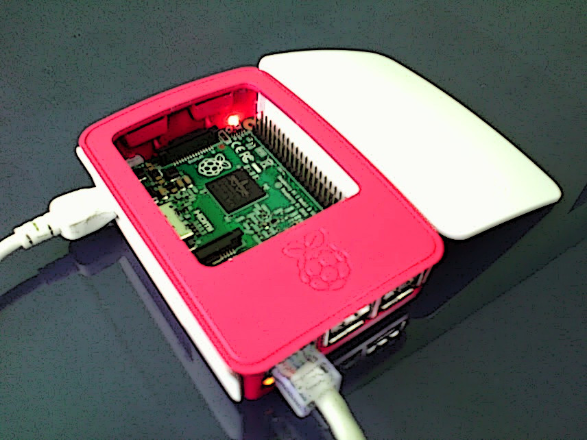
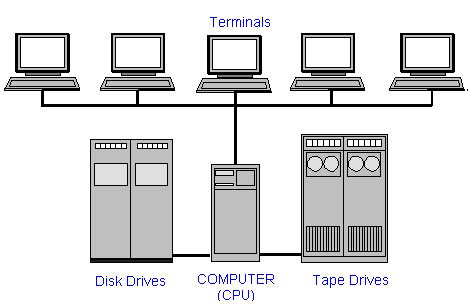

# Pendahuluan

## Mengapa CLI?

- administrasi server
    - hampir semua server berbasis UNIX
    - perintah standar, meski beda OS
    - otomatisasi dengan *shell script*
- pilihan aplikasi lebih banyak
- efektif dan efisien

---



## Server SO

- Raspberry Pi 3 Model B[^08-rpi3]
    - 1.2 GHz quad-core ARMv8 CPU
    - 1 GiB RAM
- Raspbian GNU/Linux
<!--
- Raspberry Pi 1 Model B[^08-rpi1]
    - 700 MHz *single-core* ARMv6 CPU
    - 512 MiB RAM
-->

[^08-rpi1]: <https://www.raspberrypi.org/products/model-b/>
[^08-rpi2]: <https://www.raspberrypi.org/products/raspberry-pi-2-model-b/>
[^08-rpi3]: <https://www.raspberrypi.org/products/raspberry-pi-3-model-b/>

---

{width=80%}


## Login Server

- Alamat: `172.18.12.12`
- *Login*: lihat LMS<!--
    - pola: `^[a-z][-a-z0-9_]{0,7}`
- *Password*: 5 digit terakhir NIM -->

{width=50%}


# Perintah Dasar

## `ssh`
Login ke komputer *remote*.
```bash
ssh [OPTION] [USER@]HOST
```
- `-p`: *port* koneksi
- `-X`: *X forwarding* untuk aplikasi GUI diaktifkan

## `echo`
Menampilkan satu baris teks.
```bash
echo [OPTION] [STRING]
```
- `-n`: *newline* di akhir dihilangkan
- `-e`: *escape* dengan *backslash* diaktifkan

## `hostname`
Menampilkan nama *host* sistem.
```bash
hostname [OPTION]
```
- `-I`: tampilkan alamat IP

## `uname`
Menampilkan informasi kernel sistem.
```bash
uname [OPTION]
```
- `-a`: (*all*) tampilkan semua informasi kernel

## `uptime`
Menampilkan berapa lama sistem sudah berjalan.
```bash
uptime
```

## `date`
Mencetak tanggal dan waktu sistem.
```bash
date [+FORMAT]
```

## `cal`
Menampilkan kalender.
```bash
cal [[MONTH] YEAR]
```

## `whoami`
Menampilkan nama *user* efektif.
```bash
whoami
```

## `who`
Menampilkan siapa saja yang sedang login.
```bash
who [OPTION]
```
- `-q`: (*quantity*) jumlah *user* yang sedang login
- `-w`: *write status* untuk pesan (`+`, `-`, `?`)

## `w`
Menampilkan siapa saja yang sedang login dan proses yang sedang dijalankannya.
```bash
w [USER]
```

## `last`
Menampilkan daftar waktu *user* terakhir kali *login*.
```bash
last
```

## `write`
Mengirim pesan ke *user* lain yang sedang login.
```bash
write USER [TTY]
```

<!--
## `wall`
Mengirim pesan *broadcast* ke semua *user* lain yang sedang *login*.
```bash
wall [MESSAGE]
```
-->

## `mesg`
Mengontrol akses masuk pesan ke terminal anda (ya/tidak).
```bash
mesg [y|n]
```

<!--
## `talk`
Berbicata dengan *user* lain yang sedang *login*.
```bash
talk USER@HOST [TTY]
```
-->

## `mail`
Membaca atau mengirim surat ke *user* lain.
```bash
mail [USER...]
```

---

### Contoh: mengirim surat

```
auriza@raspi:~ $ mail mukhib
Cc:
Subject: Test
Assalamu'alaikum...
[Ctrl+D]

auriza@raspi:~ $ mail mukhib kurnia
Cc:
Subject: Test 2
Tolong surat ini langsung dihapus ya...
[Ctrl+D]
```

---

### Contoh: membaca surat

```
mukhib@raspi:~ $ mail
"/var/mail/mukhib": 2 messages 2 new
>N   1 Auriza Akbar   Tue Nov  7 01:15  16/431   Test
 N   2 Auriza Akbar   Tue Nov  7 01:20  15/420   Test 2

? print 1
...
Subject: Test
From: Auriza Akbar <auriza@raspi>

Assalamu'alaikum...
```

---

```
? reply 1
To: auriza@raspi
Subject: Re: Test

Wa'alaikumussalam.
[Ctrl+D]

? print 2
...
Subject: Test 2
From: Auriza Akbar <auriza@raspi>

Tolong surat ini langsung dihapus ya...

? delete 2
? quit
```


## `passwd`
Mengganti *password* login.
```bash
passwd [OPTION] [USER]
```
- `-d`: (*delete*) hapus *password*
- `-e`: (*expire*) buat *password* menjadi kadaluwarsa


## `logout`
Keluar dari sistem.
```bash
logout
```

## `poweroff`
Mematikan (*shutdown*) sistem.
```bash
sudo poweroff
```

## `reboot`
Me-*restart* sistem.
```bash
sudo reboot
```


## Tombol *shortcut*

### `Tab`
*auto-completion*

### `Up` dan `Down`
mengakses *history* perintah yang pernah dimasukkan

### `Ctrl+D`
mengakhiri teks (*end of file*, EOF)

### `Ctrl+C`
mengakhiri proses yang sedang berjalan

### `Ctrl+L`
membersihkan layar

### `Ctrl+W`
menghapus satu kata di belakang kursor


## Sumber Informasi Tambahan

- UNIX commands list[^08-cmd]
- Explain Shell[^08-esh]
- Regular expression checker[^08-rgx]

[^08-cmd]: <https://en.wikipedia.org/wiki/Template:Unix_commands>
[^08-esh]: <http://explainshell.com>
[^08-rgx]: <http://regexr.com/>


## Tugas

- ganti *password* anda
- kirim surat ke *user* `auriza`

<!-- TODO: add user mgmt: adduser, deluser, addgroup, etc. -->
