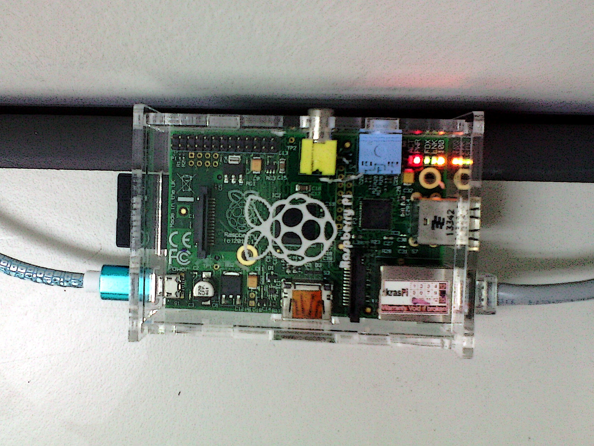

# Pendahuluan

## Mengapa CLI?

- administrasi sistem
    - hampir semua server berbasis UNIX
    - perintah sama, meskipun berbeda OS
    - bisa otomatisasi dengan *script*
- pilihan aplikasi lebih banyak
- efektif dan efisien


## Server SO

<!--
- Raspberry Pi 2 Model B[^rpi2]
    - 900 MHz quad-core ARM CPU
    - 1 GiB RAM
-->

- Raspberry Pi 1 Model B[^rpi1]
    - 700 MHz *single-core* ARMv6 CPU
    - 512 MiB RAM
- Raspbian GNU/Linux 8

[^rpi1]: <https://www.raspberrypi.org/products/model-b/>
[^rpi2]: <https://www.raspberrypi.org/products/raspberry-pi-2-model-b/>

---

{width=80%}


## Login Server

- *Host*: `172.20.35.100`
- *Username*: lihat LMS
    <!-- - pola: `^[a-z][-a-z0-9_]{0,7}` -->
- *Password*: 6 digit terakhir NIM

## Sumber Tambahan

- UNIX commands list[^cmd]
- Explain Shell[^esh]
- Regular expression checker[^rgx]

[^cmd]: <https://en.wikipedia.org/wiki/Template:Unix_commands>
[^esh]: <http://explainshell.com>
[^rgx]: <http://regexr.com/>


# Perintah Dasar

## `ssh`
Login ke komputer *remote*.
```bash
ssh [OPTION] [USER@]HOST
```
- `-p`: nomor *port* untuk koneksi
- `-X`: mengaktifkan X11 *forwarding*

## `echo`
Menampilkan satu baris teks.
```bash
echo [OPTION] [STRING]
```
- `-n`: tanpa *newline* di akhir
- `-e`: mengaktifkan interpretasi *backslash escape*

## `hostname`
Menampilkan nama *host* sistem.
```bash
hostname [OPTION]
```
- `-I`: menampilkan alamat IP *host*

## `uname`
Menampilkan informasi kernel sistem.
```bash
uname [OPTION]
```
- `-a`: menampilkan semua informasi

## `uptime`
Menampilkan berapa lama sistem sudah berjalan.
```bash
uptime
```

## `date`
Mencetak tanggal dan waktu sistem.
```bash
date [+FORMAT]
```

## `cal`
Menampilkan kalender.
```bash
cal [[MONTH] YEAR]
```

## `whoami`
Menampilkan nama *user* yang sedang dipakai.
```bash
whoami
```

## `who`
Menampilkan siapa saja yang sedang *log in*.
```bash
who [OPTION]
```
- `-q`: menampilkan semua *username* dan jumlahnya
- `-w`: menampilkan status *message* pengguna (`+`, `-`, atau `?`)

## `w`
Menampilkan siapa saja yang sedang *log in* dan apa yang dilakukannya.
```bash
w [USER]
```

## `last`
Menampilkan daftar waktu *user* terakhir kali *login*.
```bash
last
```

## `write`
Mengirim pesan ke *user* lain yang sedang *login*.
```bash
write USER [TTY]
```

<!--
## `wall`
Mengirim pesan *broadcast* ke semua *user* lain yang sedang *login*.
```bash
wall [MESSAGE]
```
-->

## `mesg`
Mengontrol akses masuk pesan ke terminal anda (ya/tidak).
```bash
mesg [y|n]
```

<!--
## `talk`
Berbicata dengan *user* lain yang sedang *login*.
```bash
talk USER@HOST [TTY]
```
-->

## `mail`
Mengecek atau mengirim surat ke *user* lain.
```bash
mail [USER]
```

## `passwd`
Mengganti *password* login.
```bash
passwd [OPTION] [USER]
```
- `-d`: menghapus *password* (*delete*)
- `-e`: membuat *password* kadaluwarsa (*expired*)

## `logout`
Keluar dari sistem.
```bash
logout
```

## `poweroff`
Mematikan (*shutdown*) sistem.
```bash
sudo poweroff
```

## `reboot`
Me-*restart* sistem.
```bash
sudo reboot
```


## Tombol *shortcut*

### `Tab`
*auto-completion*

### `Up` dan `Down`
mengakses *history* perintah yang pernah dimasukkan

### `Ctrl+D`
mengakhiri teks (*end of file*, EOF)

### `Ctrl+C`
mengakhiri proses yang sedang berjalan

### `Ctrl+L`
membersihkan layar

### `Ctrl+W`
menghapus satu kata di belakang kursor


## Tugas

- ganti *password* anda
- kirim surat ke *user* `auriza`

<!-- TODO: add user mgmt: adduser, deluser, addgroup, etc. -->
