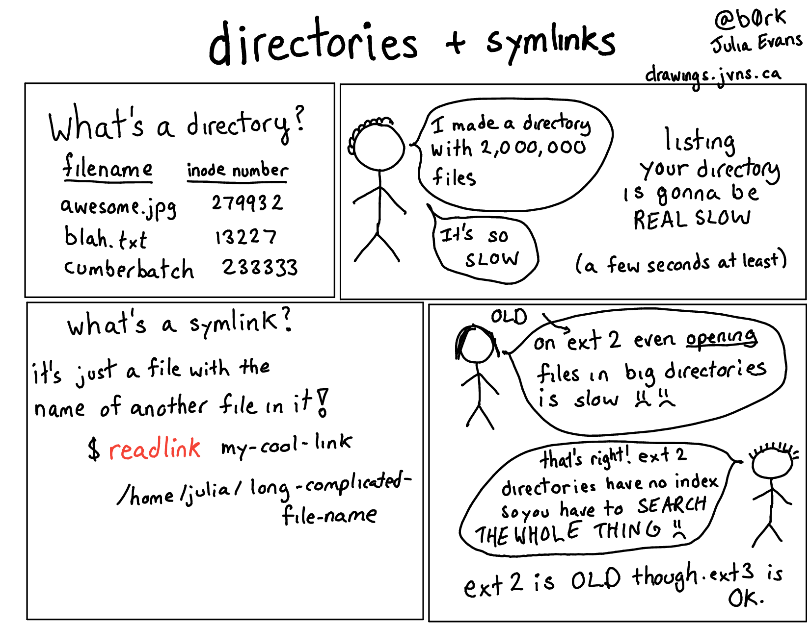

# Permission


## *Ownership*

- Tiap *file* memiliki *owner*
    - hanya *superuser* yang dapat mengubah kepemilikan *file*
- Tiap *file* memiliki *permission*
    - mengatur hak akses *file* tersebut

##  *Permission*

- Tiga jenis *user*:
    - *user owner* (`u`)
    - *group owner* (`g`)
    - *others* (`o`)

- Tiga jenis *permission*:

|*Permission* | *File*    | *Directory*           |
|------------ | --------- | --------------------- |
|`r`          | *read*    | *list files*          |
|`w`          | *write*   | *add or remove files* |
|`x`          | *execute* | *enter the directory* |

<!--

## `su`
Berubah menjadi *user* lain atau menjadi *superuser*.
```bash
su [OPTION] [USERNAME]
```
- `-c CMD`: *command*; jalankan perintah `CMD`
- `-l`: *login*; set *environment* seperti jika login langsung

-->

## `chown`
Mengubah kepemilikan suatu *file*.
```bash
chown [OPTION] OWNER[:GROUP] FILE
```
- `-R`: *recursive*; ubah direktori seisinya

---


## `chmod`
Mengubah mode *permission* suatu *file*.
```bash
chmod [OPTION] MODE FILE...
```
- `-R`: *recursive*; ubah direktori seisinya

## Format `chmod`

- Format mode simbolis:
    - `[ugoa][+-=][rwx]`
- Format mode oktal:
    - 4 (*read*) + 2 (*write*) + 1 (*exec*)

## Contoh `chmod`

- `r--r--r--`
    - `chmod a=r FILE`
    - `chmod 444 FILE`
- `rw-rw----`
    - `chmod ug=rw,o= FILE`
    - `chmod 660 FILE`
- `rwxr-xr-x`
    - `chmod u=rwx,go=rx FILE`
    - `chmod 755 FILE`

---


# Link

## Link

1. *Hard link*
    - mengacu pada nomor indeks *file* (inode)
    - tidak terpengaruh terhadap perubahan nama *file*
    - namun hanya bisa dalam satu partisi yang sama
2. *Symbolic link*
    - mengacu pada nama *file*
    - bisa lintas partisi
    - bisa membuat *link* ke direktori
    - namun jika nama *file* yang dirujuk berubah akan mengakibatkan *broken link*

---


---



## `ln`
Membuat *link* antar-*file*.
```bash
ln [OPTION] TARGET LINK-NAME
```
- `-s`: *symbolic*; buat *symlink*


# Stream

## *Stream* Standar

Setiap proses memiliki tiga *stream* standar I/O:

0. *standard input* (`stdin`)
1. *standard output* (`stdout`)
2. *standard error* (`stderr`)

```
            +------------+
            |            | --->  stdout
stdin  +--> |   PROSES   |
            |            | --->  stderr
            +------------+
```

---


## *Pipe*

- Menyalurkan *output* proses menjadi *input* proses selanjutnya
- Berguna untuk membuat *pipeline* perintah

```
                     pipe
+------------+         +        +------------+
|            |         |        |            |
|  PROCESS1  +---------|------->|  PROCESS2  |
|            | stdout  |  stdin |            |
+------------+         +        +------------+
```

- Contoh:
    - `echo "halo" | rev`
    - `echo "2 + 5" | bc`
    - `who | wc -l`

---


## *Redirect*

- Mengarahkan *stream* standar proses ke suatu *file* yang ditentukan oleh pengguna

|Karakter | *Redirect* |
|-------- | ---------- |
|`<`      | `stdin`    |
|`>`      | `stdout`   |
|`>>`     | `stdout` (*append*) |
|`2>`     | `stderr`   |

- Contoh:

    ```bash
    date > now.txt 2> err.txt
    rev < now.txt
    rev < now.txt > rev.txt
    ```

## Tugas Bonus

Buatlah sebuah blog dengan menggunakan '`hugo`'.

Panduannya lihat di:

- <http://os.apps.cs.ipb.ac.id/~auriza/blog/posts/hugo-start/>
