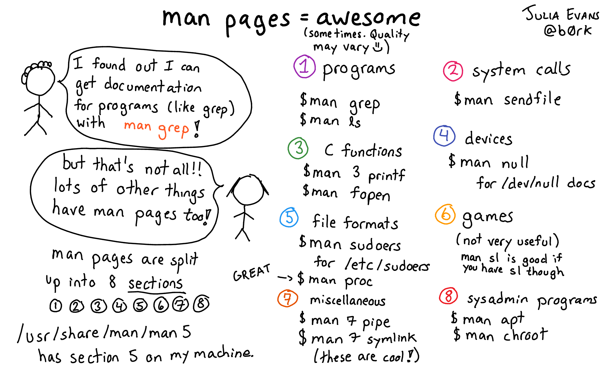

# Pencarian

## `man`
Mencari halaman manual suatu program, fungsi, dan sebagainya.
```bash
man [SECTION] PAGE
```
- `q`: (*quit*) keluar
- `/PATTERN`: pencarian kata
    - `n`: (*next*) lanjutkan pencarian kata
    - `N`: (*next-reverse*) lanjutkan pencarian kata mundur

---



## `which`
Mencari lokasi *file* program.
```bash
which COMMAND
```


## `locate`
Mencari lokasi *file* berdasarkan namanya pada *database*.
```bash
locate [OPTION] PATTERN
```
- `-i`: (*insensitive*) abaikan kapitalisasi
- `-c`: (*count*) cetak jumlah *file* yang ditemukan


## `find`
Mencari *file* langsung pada sebuah hierarki direktori.
```bash
find [PATH] [TEST]...
```
- `-name PATTERN    `: nama *file*
- `-iname PATTERN   `: nama *file* (*case insensitive*)
- `-size [+-]N[kMG] `: ukuran *file* sebesar *N*
- `-atime [+-]N     `: *file* terakhir diakses *N* hari yang lalu
- `-mtime [+-]N     `: *file* terakhir dimodifikasi *N* hari yang lalu
- `-empty           `: *file* kosong
- `-type [df]       `: jenis *file* (direktori atau *file* biasa)

## `xargs`
Mengubah tiap baris masukan menjadi argumen untuk suatu perintah.
```bash
xargs [OPTION] COMMAND
```
- `-L N`: gunakan maksimum *N* baris argumen untuk tiap perintah

### Contoh

```bash
# temukan semua file backup (.bak) di direktori ini,
# lalu hapus satu-per-satu
find . -name "*.bak" | xargs -L 1 rm
```


## `grep`
Mencetak baris *file* yang cocok dengan suatu pola.
```bash
grep [OPTION] PATTERN FILE
```
- `-c`: (*count*) tampilkan jumlah baris
- `-i`: (*insensitive*) abaikan kapitalisasi
- `-v`: (*invert*) kebalikan dari pola yang diberikan
- `-r`: rekursif


# Pemrosesan Teks


## `editor` (`nano`)
Membuat dan mengedit *file* teks.
```bash
editor [OPTION] [FILE]...
```
- `-i`: (*indent*) indentasi otomatis
- `-u`: (*undo*) mengaktifkan fitur *undo*
- `^O`: (*write-out*) menyimpan *file*
- `^X`: (*exit*) keluar dari `editor`


## `vi`
Editor teks untuk *programmer*.
```bash
vi [OPTION] [FILE]...
```

---


---


## `pager` (`less`)
Menampilkan *file* teks per halaman sesuai ukuran layar.
```bash
pager [FILE]...
```
- `q`: (*quit*) keluar
- `/PATTERN`: pencarian kata
    - `n`: (*next*) lanjutkan pencarian kata
    - `N`: (*next-reverse*) lanjutkan pencarian kata mundur


## `cat`
Menggabungkan *file* dan menampilkannya ke layar.
```bash
cat [OPTION] [FILE]...
```
- `-n`: (*number*) berikan nomor semua baris
- `-b`: (*blank*) berikan nomor baris yang ada isinya saja
- `-s`: (*squeeze*) hilangkan baris kosong yang berulang


## `split`
Memecah *file* menjadi beberapa bagian.
```bash
split [OPTION] FILE [PREFIX]
```
- `-b N`: (*bytes*) pecah per *N* *byte*
- `-l N`: (*lines*) pecah per *N* baris

## `sort`
Mengurutkan tiap baris pada *file* teks
```bash
sort [OPTION] [FILE]
```
- `-n`: (*numeric*) urutkan secara numerik
- `-r`: (*reverse*) urutkan terbalik

## `uniq`
Menampilkan baris yang unik saja
```bash
uniq [OPTION] [FILE]
```
- `-c`: (*count*) tambahkan jumlah kemunculan di awal baris
- `-d`: (*duplicate*) hanya cetak baris yang berulang
- `-i`: (*ignore-case*) abaikan perbedaan huruf kecil/kapital
- `-u`: (*unique*) hanya cetak baris yang tidak berulang

## `head`
Menampilkan bagian awal *file*.
```bash
head [OPTION] [FILE]
```
- `-n K`: (*lines*) tampilkan *K* baris pertama
- `-b K`: (*bytes*) tampilkan *K* *byte* pertama

## `tail`
Menampilkan bagian akhir *file*.
```bash
tail [OPTION] [FILE]
```
- `-n K`: (*lines*) tampilkan *K* baris terakhir
- `-b K`: (*bytes*) tampilkan *K* *byte* terakhir

## `tr`
Translasi karakter dari set pertama ke set kedua.

```bash
tr [OPTION] SET1 [SET2]
```
- `-d`: (*delete*) menghapus karakter yang terdapat pada `SET1`
- `-s`: (*squeeze*) menghapus karakter yang berulang dari `SET1`

## `sed`
*Stream editor*, memanipulasi *string* dengan ekspresi reguler.
```bash
sed [OPTION] 's/SEARCH/REPLACE/' [FILE]
```
- `-e`: (*execute*) menambahkan perintah untuk dieksekusi
- `-i`: (*in-place*) mengedit *file* langsung

## `cut`
Mengambil sebagian karakter/kolom dari sebaris teks.
```bash
cut OPTION [FILE]
```
- `-c N-M`: (*characters*) cetak karakter ke-`N` hingga `M`
- `-f N-M`: (*fields*) cetak kolom ke-`N` hingga `M`
- `-d DELIM`: (*delimiter*) karakter pemisah antarkolom

## `paste`
Menggabungkan baris-baris tiap *file*.
```bash
paste [OPTION] [FILE]
```
- `-d`: (*delimiter*) karakter pemisah antarkolom
- `-s`: (*serial*) proses tiap *file* satu per satu


# Ekspresi Reguler

## Ekspresi Reguler (Regex)

Regex adalah susunan karakter yang merupakan pola pencarian.
Regex digunakan untuk mencari *string* tertentu pada teks.

Misal, ekspresi reguler `/G64\d{6}/` dapat mencocokkan NIM semua mahasiswa S1 Ilmu Komputer IPB.

Latihan dan informasi lebih lanjut, kunjungi <http://regexr.com>.


## Referensi Singkat

- Karakter

    `.`
    : karakter apapun selain *newline*

    `[abc]`
    : karakter `a`, `b`, atau `c`

    `[^abc]`
    : bukan karakter `a`, `b`, atau `c`

    `[a-g]`
    : karakter antara `a` sampai `g`

- Kelas Karakter

    `\w`
    : kata, `[A-Za-z0-9_]`

    `\d`
    : digit, `[0-9]`

    `\s`
    : *whitespace*

- *Anchor*

    `^`
    : awal baris

    `$`
    : akhir baris


## Referensi Singkat

- Jumlah

    `*`
    : 0 atau lebih

    `+`
    : 1 atau lebih

    `?`
    : 0 atau 1

    `{3}`
    : tepat 3

    `{3,}`
    : 3 atau lebih

    `{3,5}`
    : antara 3 sampai 5

- Grup

    `(...)`
    : membuat grup

    `\n`
    : referensi balik grup ke-*n*

---


## Tugas

UNIX Text Processing Contest 2017x^[<https://www.hackerrank.com/unix-text-processing-2017x>]
