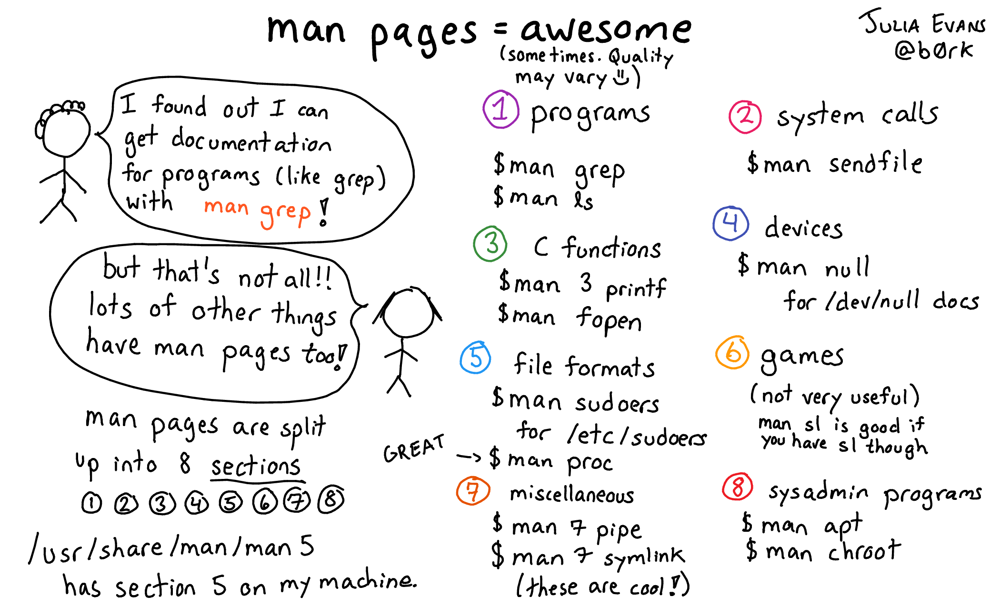

# Pencarian

## `man`
Mencari halaman manual suatu program, fungsi, dan sebagainya.
```bash
man [SECTION] PAGE
```
- `q`: *quit*; keluar
- `/`: pencarian kata
    - `n`: *next*; lanjutkan pencarian kata
    - `N`: *next-reverse*; lanjutkan pencarian kata mundur

---



## `which`
Mencari lokasi *file* program.
```bash
which COMMAND
```


## `locate`
Mencari lokasi *file* berdasarkan namanya pada *database*.
```bash
locate [OPTION] 'PATTERN'
```
- `-i`: *insensitive*; abaikan *case*
- `-c`: *count*; cetak jumlah *file* yang ditemukan


## `find`
Mencari *file* langsung pada sebuah hierarki direktori.
```bash
find [PATH] [TEST]...
```
- `-name 'PATTERN'  `
- `-iname 'PATTERN' `
- `-size [+-]N[kMG] `
- `-atime [+-]N     `
- `-mtime [+-]N     `
- `-empty           `
- `-type [dfl]      `

## `xargs`
Mengubah tiap baris masukan menjadi argumen suatu perintah.
```bash
xargs [OPTION] COMMAND
```
- `-L N`: *line*; gunakan *N* baris argumen untuk tiap perintah

### Contoh

```bash
# temukan semua file backup (.bak) di direktori ini,
# lalu hapus satu-per-satu
find . -name '*.bak' | xargs -L 1 rm
```


## `grep`
Mencetak baris teks yang cocok dengan suatu pola.
```bash
grep [OPTION] 'PATTERN' FILE
```
- `-c`: *count*; tampilkan jumlah baris
- `-i`: *insensitive*; abaikan *case*
- `-v`: *invert*; kebalikan dari pola yang diberikan
- `-r`: rekursif


# Editor Teks

## `editor` (`nano`)
Membuat dan mengedit *file* teks.
```bash
editor [OPTION] [FILE]...
```
- `-i`: *indent*; indentasi otomatis
- `-u`: *undo*; aktifkan fitur *undo*
- `^O`: *write-out*; simpan *file*
- `^X`: *exit*

## `micro`
Editor teks yang intuitif dan mudah dipakai, penerus '`nano`'.
```bash
micro [FILE]...
```
- `^X`, `^C`, `^V`: *cut*, *copy*, *paste*
- `^Z`: *undo*
- `^S`: *save*
- `^Q`: *quit*

## `vi`
Editor teks untuk *programmer*.
```bash
vi [OPTION] [FILE]...
```

---


---


# Pemrosesan Teks


## `cat`
Menggabungkan *file* dan menampilkannya ke layar.
```bash
cat [OPTION] [FILE]...
```
- `-n`: *number*; berikan nomor baris


## `split`
Memecah *file* menjadi beberapa bagian.
```bash
split [OPTION] FILE [PREFIX]
```
- `-b N`: *bytes*; pecah per *N* *byte*
- `-l N`: *lines*; pecah per *N* baris

## `sort`
Mengurutkan baris teks pada *file*.
```bash
sort [OPTION] [FILE]
```
- `-n`: *numeric*; urutkan secara numerik
- `-r`: *reverse*; urutkan terbalik

## `uniq`
Menghilangkan baris teks yang berulang.
```bash
uniq [OPTION] [FILE]
```
- `-c`: *count*; tampilkan jumlah kemunculan
- `-i`: *ignore-case*
- `-u`: *unique*; cetak baris yang unik saja
- `-d`: *duplicate*; cetak baris yang berulang saja

## `pager` (`less`)
Menampilkan *file* teks per halaman layar.
```bash
pager [FILE]...
```
- `q`: *quit*; keluar
- `/`: pencarian kata
    - `n`: *next*; lanjutkan pencarian kata
    - `N`: *next-reverse*; lanjutkan pencarian kata mundur

## `head`
Menampilkan bagian awal *file*.
```bash
head [OPTION] [FILE]
```
- `-n K`: *lines*; tampilkan *K* baris pertama
- `-b K`: *bytes*; tampilkan *K* *byte* pertama

## `tail`
Menampilkan bagian akhir *file*.
```bash
tail [OPTION] [FILE]
```
- `-n K`: *lines*; tampilkan *K* baris terakhir
- `-b K`: *bytes*; tampilkan *K* *byte* terakhir
- `-f`: *follow*; ikuti penambahan isi *file*

---


## `tr`
Translasi karakter dari set pertama ke set kedua.

```bash
tr [OPTION] SET1 [SET2]
```
- `-d`: *delete*; hapus karakter pada *SET1*
- `-s`: *squeeze*; hapus karakter yang berulang pada *SET1*

## `sed`
*Stream editor*, manipulasi baris teks dengan *regular expression*.
```bash
sed [OPTION] 's/SEARCH/REPLACE/' [FILE]
```
- `-e`: *execute*; tambahkan perintah untuk dieksekusi
- `-i`: *in-place*; edit *file* langsung

## `cut`
Mengambil karakter/kolom tertentu dari tiap baris teks.
```bash
cut OPTION [FILE]
```
- `-c N-M`: *char*; cetak karakter *N--M*
- `-f N-M`: *field*; cetak kolom *N--M*
- `-d DELIM`: *delimiter*; pemisah antarkolom

## `paste`
Menggabungkan tiap baris dari beberapa *file* per kolom.
```bash
paste [OPTION] [FILE...]
```
- `-d`: *delimiter*; pemisah antarkolom
- `-s`: *serial*; gabungkan isi *file* menjadi sebaris

## `join`
Menggabungkan baris dari dua *file* berdasarkan kolom tertentu.
```bash
join [OPTION] FILE1 FILE2
```
- `-1`: nomor kolom *FILE1*
- `-2`: nomor kolom *FILE2*
- `-t`: karakter pemisah antarkolom
- `-o`: format keluaran

## `diff`
Membandingkan antara dua *file* per baris.
```bash
diff [OPTION] FILE1 FILE2
```
- `-u`: *unified*; keluaran termasuk konteks baris
- `-y`: *side-by-side*; keluaran dua kolom
- `-r`: *recursive*; bandingkan direktori seisinya
- `-w`: *white space*; abaikan semua *white space*


## `wc`
Mencetak jumlah baris, kata, dan karakter dari suatu *file*.
```bash
wc [OPTION] [FILE...]
```
- `-c`: *char*; cetak jumlah karakter
- `-w`: *word*; cetak jumlah kata
- `-l`: *line*; cetak jumlah baris


# Ekspresi Reguler

## Ekspresi Reguler (Regex)

Regex adalah susunan karakter yang merupakan pola pencarian.
Regex digunakan untuk mencari *string* tertentu pada teks.

Misal, ekspresi reguler `/G64\d{6}/` dapat mencocokkan NIM semua mahasiswa S1 Ilmu Komputer IPB.

Latihan dan informasi lebih lanjut, kunjungi <http://regexr.com>.


## Referensi Singkat

- Karakter

    `.`
    : karakter apapun selain *newline*

    `[abc]`
    : karakter `a`, `b`, atau `c`

    `[^abc]`
    : bukan karakter `a`, `b`, atau `c`

    `[a-g]`
    : karakter antara `a` sampai `g`

- Kelas karakter

    `\w`
    : kata, `[A-Za-z0-9_]`

    `\d`
    : digit, `[0-9]`

    `\s`
    : *whitespace*

- *Anchor*

    `^`
    : awal baris

    `$`
    : akhir baris


## Referensi Singkat

- Jumlah

    `*`
    : 0 atau lebih

    `+`
    : 1 atau lebih

    `?`
    : 0 atau 1

    `{3}`
    : tepat 3

    `{3,}`
    : 3 atau lebih

    `{3,5}`
    : antara 3 sampai 5

- Grup

    `(...)`
    : membuat grup

    `\n`
    : referensi balik grup ke-*n*

---


## Tugas

UNIX Text Processing Contest 2017^[<https://www.hackerrank.com/unix-text-processing-2017>]
