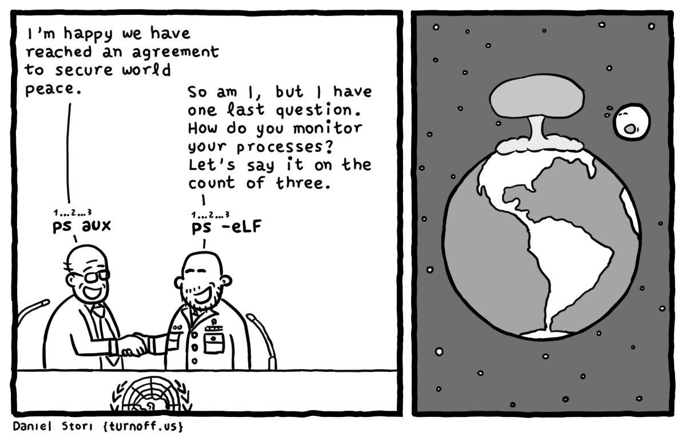
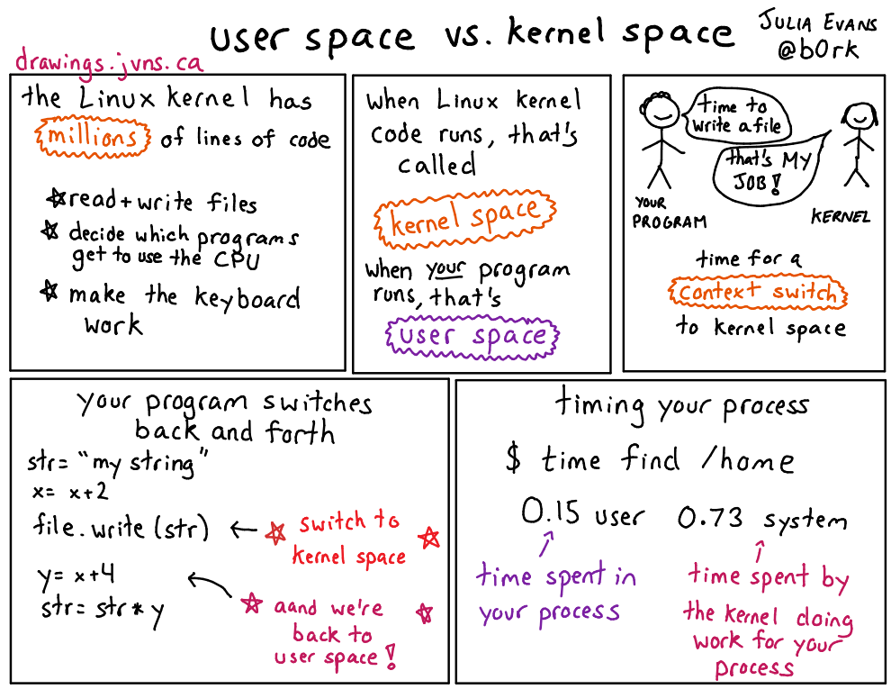
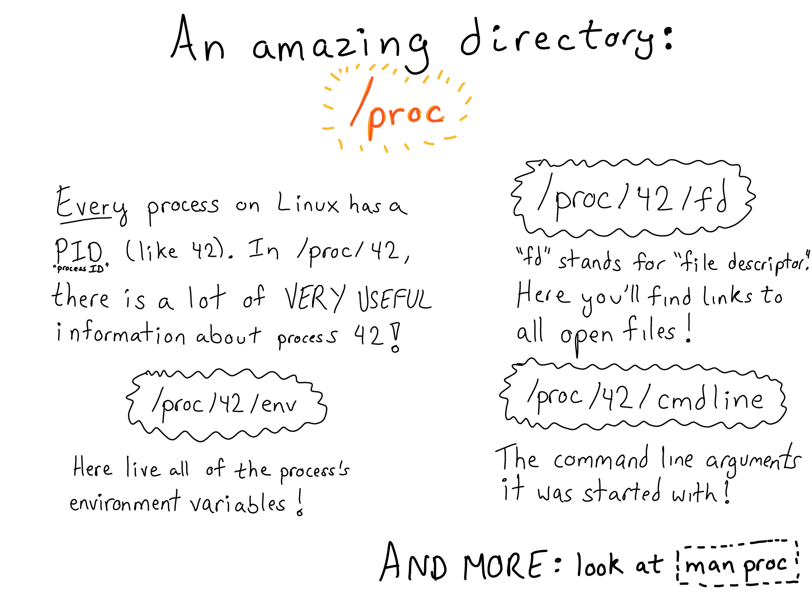
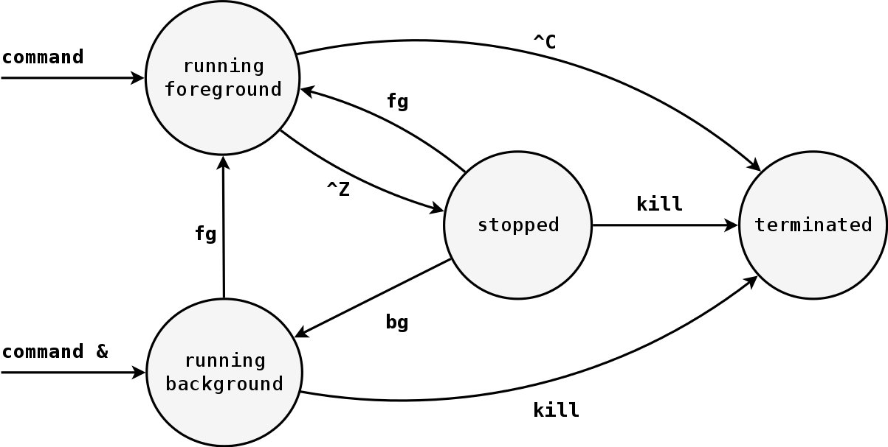

## Tugas

- Login ke server `172.18.12.12`
- Buat *file* bernama `hrank.txt` di *home* yang berisi *username* anda di kontes HackerRank; contoh:
    - `echo 'auriza_akbar' > ~/hrank.txt`{.bash}
- **Penting**: untuk penilaian kontes

# Proses

## `ps`
Menampilkan cuplikan informasi proses yang sedang berjalan.
```bash
ps [OPTION]
```
- `-A`: *all*; tampilkan semua proses
- `-F`: *full*; tampilkan format lengkap
- `-L`: *light-weight process*; tampilkan info *thread*

<!--
---


-->

## `pstree`
Menampilkan pohon proses.
```bash
pstree [OPTION] [PID,USER]
```
- `-n`: *numeric*; urutkan berdasarkan PID
- `-p`: tampilkan PID

## `top`, `htop`
Memonitor proses secara interaktif.
```bash
htop [OPTION]
```
- `-u USER`: tampilkan proses milik *USER*
- `-p PID`: tampilkan proses *PID*

---

: Atribut proses[^12-htop]

Atribut     Keterangan
-----       -----
`PID`       ID proses
`USER`      pemilik proses
`PR`, `NI`  prioritas, nilai *nice*
`VIRT`      ukuran memori virtual
`RES`       ukuran memori residen (fisik)
`SHR`       ukuran memori *shared*
`S`         status proses
            - `R`: *running*
            - `S`: *sleeping*
            - `D`: *waiting for disk*
            - `T`: *stopped*

[^12-htop]: *lihat* '`man htop`'

## `pidof`
Mendapatkan PID dari nama program yang sedang berjalan.
```bash
pidof PROGRAM
```

## `kill`
Mengirim sinyal ke suatu proses (*default*: `SIGTERM`).
```bash
kill [-SIG] PID...
```
- `-INT`
- `-KILL`
- `-STOP`
- `-CONT`

## `pmap`
Menampilkan *memory map* sebuah proses.
```bash
pmap PID
```

## `lsof`
Menampilkan daftar *file* yang sedang dibuka oleh proses.
```bash
lsof [-p PID] [FILENAME...]
```

## `nice`
Menjalankan program dengan prioritas *nice*[^12-nice] tertentu (*default*: 10).
```bash
nice [-n NICE] COMMAND
```

[^12-nice]: nilai *nice* antara -20 (prioritas tinggi) sampai 19 (prioritas rendah)

## `renice`
Mengubah prioritas proses yang sudah berjalan.
```bash
renice [-n] NICE PID
```

## `time`
Menjalankan program dan menampilkan penggunaan waktu CPU.
```bash
time COMMAND
```

## `timeout`
Menjalankan program dengan batasan waktu tertentu.
```bash
timeout DURATION COMMAND
```

## `prlimit`
Mengatur batas penggunaan *resource* proses.
```bash
prlimit [OPTION] COMMAND
```
- `-t`: *time*; waktu CPU (detik)
- `-s`: *stack*; ukuran *stack* (byte)
- `-v`: *virtual memory*; ukuran memori (byte)
- `-n`: *number of open files*

---


---



---




# Job

## Job

*Job*: kumpulan proses yang berjalan bersama dalam satu *shell*.

{width=75%}


## Proses Background

Untuk menjalankan proses di *background*, tambahkan tanda `&` pada akhir perintah.
```bash
COMMAND... &
```

## `jobs`
Menampilkan daftar *job* yang sedang aktif.
```bash
jobs
```

## `fg`
Memindahkan *job* ke *foreground*.
```bash
fg %JOB
```

## `bg`
Memindahkan *job* ke *background*.
```bash
bg %JOB
```

## `at`
Menjadwalkan *job* untuk dijalankan kemudian.
```bash
at HH:MM [YYYY-MM-DD]
```
- `-l`: *list*; tampilkan daftar antrian *job*
- `-r`: *remove*; hapus *job* dari antrian


# Latihan UASP

---

```bash
# pindah ke direktori home anda
...
# buat satu folder kosong 'test'
...
# masuk ke direktori 'test'
...
# tampilkan path direktori saat ini
...
# buat file kosong bernama 'empty.txt'
...
```

---

```bash
# copy file '/etc/timezone' ke direktori ini
...
# ubah nama file 'timezone' menjadi 'tz.txt'
...
# list isi direktori ini
...
# pindah ke direktori parent
...
# hapus direktori 'test' seisinya
...
```

---

```bash
# temukan file dengan nama 'fdisk' memakai `locate`
...
# temukan file dengan nama 'fdisk' memakai `find`
...
# temukan file pada home anda yang ukurannya > 200 MB
...
# temukan file pada home anda yang diubah < 3 hari
...
# temukan file pada home anda yang diakses > 30 hari
...
```

---

```bash
# tampilkan 5 baris pertama keluaran perintah `last`
...
# tampilkan dua baris terakhir file '/etc/passwd'
...
# cari file di '/usr/include' yang memuat kata 'sem_post'
...
# tampilkan kolom 1 dan 5 dari file '/etc/passwd'
...
# tampilkan isi file '/etc/motd' dalam huruf kapital
...
```

---

```bash
# jalankan `cat /dev/random > rand.txt` di background
...
# tampilkan daftar job
...
# kirim sinyal STOP ke job tersebut
...
# lanjutkan job tersebut di background
...
# kirim sinyal TERM ke job tersebut
...
```

## Kisi-kisi

```
echo hostname uname date cal who
cd pwd ls touch
cp mv rm mkdir rmdir
chmod ln
locate find wc
cat head tail sort uniq cut tr grep sed
ps nice renice pidof kill
& jobs fg bg
```

## Aturan

- HP silent, taruh di dalam tas; tas taruh depan
- tidak membawa apapun di meja
- boleh membuka materi di LMS atau GitHub
    - <https://github.com/auriza/os-lab>
- pelanggaran (mencontek, kerjasama, berisik, dll): nilai **0**
