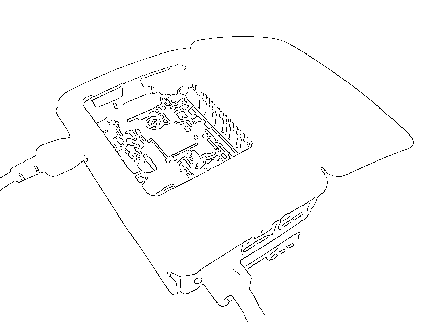
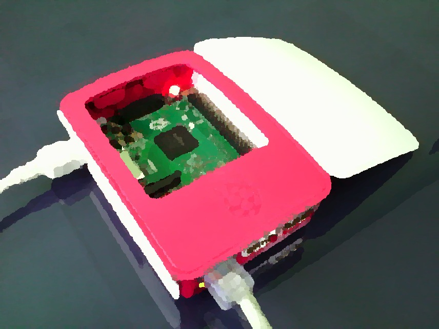
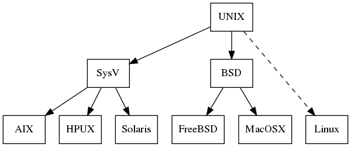

# Kompresi

## `tar`
Menyimpan dan mengekstrak *file* dari arsip *tape*/*disk*.
```sh
tar [OPTION] [PATHNAME...]
```
- `-c`: buat arsip baru
- `-x`: ekstrak *file* dari arsip
- `-f FILE`: gunakan `FILE` ini
- `-C DIR`: ganti ke direktori `DIR`
- `-z`: filter `gzip`

## `gzip`
Mengkompresi *file*.
```sh
gzip [OPTION] [FILE]
```

## `gunzip`
Mengekstrak *file*.
```sh
gunzip [OPTION] [FILE]
```

## `tar.gz`

\

\centering\tiny (sumber: <https://commons.wikimedia.org/wiki/File%3ATargzip.svg>)

\normalsize

```sh
# compress
tar -c "DIR" | gzip > "DIR.tar.gz"

# extract
gunzip < "DIR.tar.gz" | tar -x
```

## `tar.gz`

\

\centering\tiny (sumber: <https://commons.wikimedia.org/wiki/File%3ATargzip.svg>)

\normalsize

```sh
# compress
tar -cz "DIR" -f "DIR.tar.gz"

# extract
tar -xzf "DIR.tar.gz"
```


## `zip`
Membungkus dan mengkompresi *file*.
```sh
zip [OPTION] ZIPFILE FILE...
```
- `-e`: enkripsi
- `-r`: rekursif

## `unzip`
Mengekstrak *file* arsip ZIP.
```sh
unzip [OPTION] ZIPFILE
```
- `-d DIR`: ekstrak ke direktori `DIR`

## `gpg`
Enkripsi dan tanda tangan digital.
```sh
gpg [OPTION] [FILE]
```
- `-e`: enkripsi kunci publik
- `-c`: enkripsi kunci simetris
- `-d`: dekripsi


# Konversi

## `convert`
Konversi format citra, ukuran, *blur*, *crop*, dan sebagainya.
```sh
convert INFILE [OPTION] OUTFILE
```
- `-blur GEOM`: mengurangi detail
- `-canny GEOM`: deteksi tepi Canny
- `-equalize`: ekualisasi histogram
- `-negate`: balikan warna
- `-normalize`: normalisasi jangkauan warna
- `-paint RADIUS`: efek lukisan minyak
- `-resize GEOM`: mengubah ukuran

---

```sh
convert "rpi.jpg" -canny 2x2 -negate "rpic.png"
```
\centering
{width=33%}\

```sh
convert "rpi.jpg" -paint 5 "rpip.jpg"
```

{width=33%}\


## `avconv`
Konversi audio dan video.
```sh
avconv [IN-OPTION] -i INFILE [OUT-OPTION] OUTFILE
```
- `-b`: *bitrate*
- `-f`: *frame rate*
- `-s`: *frame size*
- `-ss`: waktu awal
- `-t`: waktu durasi
- `-vcodec`: *video codec*
- `-qscale:v`: kualitas video (1 = *best*, 31 = *worst*)


## `pandoc`
Konversi Markdown ke format lainnya (HTML, LaTeX, PDF).
```sh
pandoc [OPTION] [FILE...]
```
- `-s`: *standalone*, dokumen utuh
- `-t FMT`: format keluaran: `hmtl5`, `beamer`, `revealjs`, ...
- `-o FILE`: tulis keluaran ke `FILE`
- `--mathjax`: render persamaan matematis

---

```sh
echo "# Heading" | pandoc
# <h1 id="heading">Heading</h1>

echo "# Heading" | pandoc -t latex
# \section{Heading}\label{heading}

pandoc -s "file.md" -o "file.html"

pandoc "file.md" -o "file.pdf"

pandoc -t beamer "slide.md" -o "slide.pdf"
```


## `tesseract`
Konversi citra ke teks (*optical character recognition*).
```sh
tesseract IMAGEFILE OUTFILE
```
- `-l LANG`: bahasa yang digunakan (`eng`, `ind`, `ara`, ...)

---

\begingroup\centering
{width=30%}\
\endgroup

```bash
tesseract -l ind "shalat.jpg" stdout
# Jagalah shalat waij dan (terutama) shalat 'Ashr
# Quran . Com/21238

tesseract -l ara "shalat.jpg" stdout
```
<!--
\textarabic{حافظوا على الصلوات}

\textarabic{والصلاة الوسطى}
-->

## `espeak`
Konversi teks ke suara (*speech synthesizer*).
```sh
espeak [OPTION] [WORDS]
```
- `-p INT`: ketebalan suara (0--99)
- `-s INT`: kecepatan kata per menit
- `-v VOICE`: jenis suara (`en`, `id`, `fr`, ...)

## `dot`
Konversi teks ke graf.
```sh
dot [OPTION] [FILE]
```
- `-Tpng`: format keluaran PNG
- `-Tsvg`: format keluaran SVG

---

```sh
echo "
digraph unix {
    UNIX -> {SysV BSD Linux};
    SysV -> {AIX HPUX Solaris};
    BSD -> MacOSX;
}
" | dot -Tpng > "unix.png"

```

\begingroup\centering
{width=70%}\
\endgroup


## `figlet`
Konversi teks ke karakter besar.
```sh
figlet [OPTION] [MESSAGE]
```
- `-c`: rata tengah
- `-f FONT`: pilih jenis *font* (format `.flf`)
- `-w INT`: atur lebar keluaran teks

---

```bash
figlet "Hello"
```
```
 _   _      _ _
| | | | ___| | | ___
| |_| |/ _ \ | |/ _ \
|  _  |  __/ | | (_) |
|_| |_|\___|_|_|\___/

```
```bash

figlet -f block "Hello"
```
```
_|    _|            _|  _|
_|    _|    _|_|    _|  _|    _|_|
_|_|_|_|  _|_|_|_|  _|  _|  _|    _|
_|    _|  _|        _|  _|  _|    _|
_|    _|    _|_|_|  _|  _|    _|_|
```

# Info Sistem

## `lscpu`
Menampilkan informasi tentang arsitektur CPU.
```sh
lscpu
```

## `lshw`
Menampilkan informasi konfigurasi perangkat keras.
```sh
lshw [OPTION]
```
- `-short`: format pendek
- `-html`: format HTML

## `lspci`
Menampilkan informasi semua perangkat PCI.
```sh
lspci [OPTION]
```
- `-k`: tampilkan *driver* kernel yang menangani perangkat
- `-v`: tampilkan informasi detail
- `-vv`: tampilkan informasi lebih detail

## `lsusb`
Menampilkan informasi perangkat USB.
```sh
lsusb [OPTION]
```
- `-t`: tampilkan pohon hierarki perangkat
- `-v`: tampilkan informasi detail


## `lsblk`
Menampilkan informasi perangkat blok.
```sh
lsblk [OPTION]
```
- `-m`: tampilkan pemilik dan mode
- `-t`: tampilkan topologi perangkat blok

## `lslocks`
Menampilkan daftar kunci yang sedang dipegang.
```sh
lslocks [OPTION]
```
- `-p PID`: tampilkan proses ini saja

## `lsof`
Menampilkan daftar *file* yang sedang dibuka.
```sh
lsof [OPTION] [FILENAME]
```
- `-p PID`: tampilkan proses ini saja
- `-u USER`: tampilkan proses dari *user* ini saja
- `-i`: tampilkan soket Internet
- `-U`: tampilkan soket UNIX

## `df`
Menampilkan sisa ruang disk.
```sh
df [OPTION]
```
- `-a`: *all*; tampilkan semua *filesystem*
- `-h`: *human-readable*; format ukuran
- `-i`: *inode*; tampilkan info inode
- `-T`: *type*; tampilkan jenis *filesystem*

## `du`
Menampilkan penggunaan disk.
```sh
du [OPTION] [FILE]
```
- `-d N`: *depth*; tingkat kedalaman direktori
- `-h`: *human-readable*; format ukuran
- `-s`: *summary*; tampilkan total ukuran
- `--inodes`: tampilkan informasi penggunaan *inode*

## `free`
Menampilkan besar memori yang kosong dan terpakai.
```sh
free [OPTION]
```
- `-h`: *human-readable*; format ukuran

## `vmstat`
Menampilkan statistik *virtual memory*.
```sh
vmstat [OPTION] [DELAY]
```
- `-d`: tampilkan statistik disk
- `-s`: tampilkan total statistik memori
- `-w`: mode tampilan lebar
- `-S M`: unit keluaran dalam mega

## `bmon`
Monitor *bandwidth* jaringan.
```sh
bmon [OPTION]
```
- `-p IF`: tampilkan *network interface* ini saja

<!--
# \textarabic{شكرا}
-->
