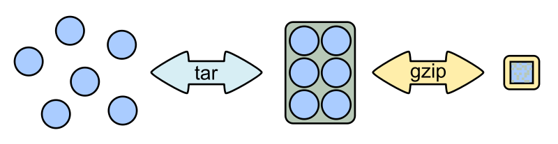

# Kompresi *File*

## `tar`
Menggabung beberapa *file* ke dalam satu *file* arsip (_**t**ape **ar**chive_).
```sh
tar [OPTION] [FILE...]
```
- `-c`: *create*; buat arsip baru
- `-x`: *extract*; ekstrak arsip
- `-f`: *file*; gunakan *file* berikut
- `-z`: *zip*; gunakan kompresi `gzip`
- `-C`: *chdir*; ekstrak ke direktori berikut

## `gzip`
Mengompres *file*.
```sh
gzip [FILE...]
```

## `gunzip`
Mengekstrak *file*.
```sh
gunzip [FILE...]
```

## `tar.gz`

\

\centering\tiny (sumber: <https://commons.wikimedia.org/wiki/File%3ATargzip.svg>)

\normalsize

```sh
# compress
tar -c FILE... | gzip > ARCHIVE.tar.gz

# extract
gunzip < ARCHIVE.tar.gz | tar -x
```

## `tar.gz`

\

\centering\tiny (sumber: <https://commons.wikimedia.org/wiki/File%3ATargzip.svg>)

\normalsize

```sh
# compress
tar -czf ARCHIVE.tar.gz FILE...

# extract
tar -xzf ARCHIVE.tar.gz
```


## `zip`
Membungkus dan mengkompresi *file*.
```sh
zip [OPTION] ARCHIVE FILE...
```
- `-e`: *encrypt*; kunci dengan *password*
- `-r`: *recursive*; direktori seisinya

## `unzip`
Mengekstrak *file* arsip ZIP.
```sh
unzip ARCHIVE [-d DIR]
```
- `-d`: *directory*; ekstrak ke direktori berikut


# Konversi *File*

## `convert`
Konversi citra: format, ukuran, efek, dan sebagainya.
```sh
convert INFILE [OPTION] OUTFILE
```
- `-blur      WIDTHxHEIGHT:` menyamarkan detail
- `-canny     WIDTHxHEIGHT:` deteksi tepi
- `-equalize              :` ekualisasi histogram
- `-negate                :` negatif
- `-normalize             :` normalisasi warna
- `-paint     RADIUS      :` efek lukisan minyak
- `-resize    WIDTHxHEIGHT:` mengubah ukuran

---

\small
\centering

```sh
convert rpi.jpg -canny 2x2 -negate rpi-edge.png

convert rpi.jpg -paint 5 rpi-paint.jpg
```

{width=45%}
{width=45%}\


## `ffmpeg`
Konversi audio dan video.
```sh
ffmpeg -i INFILE [OPTION] OUTFILE
```
- `-b`: *bitrate*
- `-c`: *codec*
- `-ss`: *seek start*; waktu awal
- `-to`: waktu akhir

---

```sh
# cut video from 2:00 to 4:00
ffmpeg -i IN.mp4 -c copy -ss 2:00 -to 4:00 OUT.mp4

# extract audio from video (MP4 -> M4A)
ffmpeg -i IN.mp4 -vn -c:a copy OUT.m4a

# extract audio from video (MP4 -> MP3)
ffmpeg -i IN.mp4 -c:a mp3 OUT.mp3
```

## `pandoc`
Konversi Markdown ke format lain (HTML, LaTeX, PDF).
```sh
pandoc [OPTION] [INFILE...] -o OUTFILE
```
- `-s`: *standalone*; dokumen HTML utuh
- `-t`: *to*; format keluaran

---

```sh
# HTML
pandoc file.md -o file.html -s

# PDF
pandoc file.md -o file.pdf

# HTML slide
pandoc slide.md -t slidy  -o slide.html -s

# PDF slide
pandoc slide.md -t beamer -o slide.pdf
```


## `tesseract`
Konversi citra ke teks (*optical character recognition*).
```sh
tesseract [OPTION] INFILE OUTFILE
```
- `-l`: *language*; gunakan bahasa berikut

---

\centering
{width=30%}\

\tiny(<https://raw.githubusercontent.com/auriza/os-lab/master/img/shalat.jpg>)
\normalsize

```bash
tesseract shalat.jpg stdout
# Jagalah shalat wajib dan (terutama) shalat ‘Ashr
# quran. com/2/238

tesseract -l ara shalat.jpg stdout
```

\textarabic{حافظوا على الصلوات}

\textarabic{والصلاة الوسطى}

## `espeak`
Konversi teks ke suara (*speech synthesizer*).
```sh
espeak [OPTION] [WORDS]
```
- `-p`: *pitch*; ketebalan suara (0--99)
- `-s`: *speed*; kecepatan kata per menit
- `-v`: *voice*; jenis suara (`en`, `id`, `fr`, ...)

---

```bash
# default English voice
espeak "Hello world"

# Indonesian voice
espeak -v id "Institut Pertanian Bogor"

# create audiobook
man gittutorial | espeak --stdout | ffmpeg -i - git.mp3
```

## `dot`
Konversi teks ke graf.
```sh
dot [OPTION] [FILE]
```
- `-Tpng`: format keluaran PNG
- `-Tsvg`: format keluaran SVG

---

```sh
echo "digraph unix {
    node [shape=box]
    UNIX -> {SysV BSD}
    SysV -> {AIX HPUX Solaris}
    BSD  -> {FreeBSD MacOSX}
    UNIX -> Linux [style=dashed]
    {rank=same Linux MacOSX}
}" | dot -Tpng > unix.png
```

\begingroup\centering
{width=60%}\
\endgroup

---

\


# Info Sistem

## `lscpu`
Menampilkan informasi tentang arsitektur CPU.
```sh
lscpu
```

## `lshw`
Menampilkan informasi konfigurasi perangkat keras.
```sh
lshw [OPTION]
```
- `-short`: format pendek
- `-html`: format HTML

## `lspci`
Menampilkan informasi perangkat PCI.
```sh
lspci [OPTION]
```
- `-k`: *kernel*; nama *driver* kernel
- `-v`: *verbose*; info detail

## `lsusb`
Menampilkan informasi perangkat USB.
```sh
lsusb [OPTION]
```
- `-t`: *tree*; pohon hierarki
- `-v`: *verbose*; info detail


## `lsblk`
Menampilkan informasi perangkat blok.
```sh
lsblk [OPTION]
```
- `-m`: *mode*; pemilik dan mode *permission*
- `-t`: *topology*; topologi perangkat blok

## `lslocks`
Menampilkan daftar kunci yang sedang dipegang.
```sh
lslocks [OPTION]
```
- `-p`: PID; proses dengan PID berikut saja

## `lsof`
Menampilkan daftar *file* yang sedang dibuka.
```sh
lsof [OPTION] [FILENAME]
```
- `-p`: PID; proses dengan PID berikut saja
- `-u`: *user*; proses dari *user* berikut saja
- `-i`: Internet *socket*
- `-U`: UNIX *socket*

## `df`
Menampilkan sisa ruang disk.
```sh
df [OPTION]
```
- `-a`: *all*; semua *filesystem*
- `-h`: *human-readable*; format ukuran
- `-i`: *inode*; info inode
- `-T`: *type*; jenis *filesystem*

## `du`
Menampilkan penggunaan disk.
```sh
du [OPTION] [FILE]
```
- `-d`: *depth*; kedalaman direktori
- `-h`: *human-readable*; format ukuran
- `-s`: *summary*; total ukuran
- `--inodes`: info pemakaian *inode*

## `free`
Menampilkan besar memori yang kosong dan terpakai.
```sh
free [OPTION]
```
- `-h`: *human-readable*; format ukuran

## `vmstat`
Menampilkan statistik *virtual memory*.
```sh
vmstat [OPTION] [DELAY]
```
- `-d`: *disk*; statistik *disk*
- `-s`: *stat*; statistik memori
- `-w`: *wide*; mode tampilan lebar
- `-S M`: satuan dalam MiB

## `sensors`
Menampilkan info sensor.
```sh
sensors
```

# Tugas

## CommandLine-Fu

- Tuliskan salah satu perintah *command line* yang menurut anda paling bermanfaat atau keren atau apapun itu ke <https://commandlinefu.com>
- Kirim *link*-nya ke <https://forms.gle/6Lt9Va8VPh9VjLwL9>
- Berikan *upvote* ke *link* teman kalian jika kalian suka
    - daftar: <https://docs.google.com/spreadsheets/d/17PbdgwMnEn4elp7_sCI3EwtbC8wCzh0xtboCRsd0EK0/edit?usp=sharing>

## Terima Kasih

\Huge
\centering

\textarabic{شكرا}
