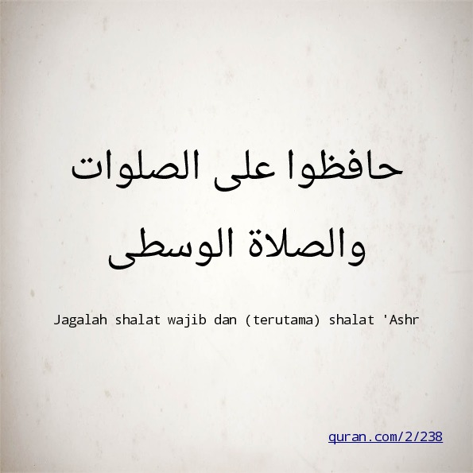

# Kompresi

## `tar`
Menyimpan dan mengekstrak *file* arsip (**_t_**_ape_ **_ar_**_chive_).
```sh
tar [OPTION] [FILE...]
```
- `-c`: *create*; buat arsip baru
- `-x`: *extract*; ekstrak arsip
- `-f`: *file*; gunakan *file* arsip berikut
- `-z`: *zip*; gunakan kompresi `gzip`
- `-C`: *chdir*; ekstrak ke direktori berikut

## `gzip`
Mengkompresi *file*.
```sh
gzip [FILE...]
```

## `gunzip`
Mengekstrak *file*.
```sh
gunzip [FILE...]
```

## `tar.gz`

\

\centering\tiny (sumber: <https://commons.wikimedia.org/wiki/File%3ATargzip.svg>)

\normalsize

```sh
# compress
tar -c DIR | gzip > DIR.tar.gz

# extract
gunzip < DIR.tar.gz | tar -x
```

## `tar.gz`

\

\centering\tiny (sumber: <https://commons.wikimedia.org/wiki/File%3ATargzip.svg>)

\normalsize

```sh
# compress
tar -cz DIR -f DIR.tar.gz

# extract
tar -xz -f DIR.tar.gz
```


## `zip`
Membungkus dan mengkompresi *file*.
```sh
zip [OPTION] ZIPFILE FILE...
```
- `-e`: *encrypt*; kunci dengan *password*
- `-r`: *recursive*; direktori seisinya

## `unzip`
Mengekstrak *file* arsip ZIP.
```sh
unzip ZIPFILE [-d EXDIR]
```
- `-d`: *directory*; ekstrak ke direktori berikut

## `gpg`
Enkripsi dan tanda tangan digital.
```sh
gpg [OPTION] [FILE]
```
- `-c`: *encrypt*; enkripsi dengan kunci simetris
- `-d`: *decrypt*; dekripsi


# Konversi

## `convert`
Konversi format citra, ukuran, *blur*, *crop*, dan sebagainya.
```sh
convert INFILE [OPTION] OUTFILE
```
- `-blur`: samar
- `-canny`: deteksi tepi
- `-equalize`: ekualisasi histogram
- `-negate`: negatif
- `-normalize`: normalisasi warna
- `-paint`: efek lukisan minyak
- `-resize`: ubah ukuran

---

```sh
convert rpi.jpg -canny 2x2 -negate rpi-edge.png
```
\centering
{width=33%}\

```sh
convert rpi.jpg -paint 5 rpi-paint.jpg
```

{width=33%}\


## `avconv`
Konversi audio dan video.
```sh
avconv [IN-OPTION] -i INFILE [OUT-OPTION] OUTFILE
```
- `-b`: *bitrate*
- `-f`: *frame rate*
- `-s`: *frame size*
- `-ss`: *seek start*; waktu awal
- `-t`: *time*; durasi waktu


## `pandoc`
Konversi Markdown ke format lainnya (HTML, LaTeX, PDF).
```sh
pandoc [OPTION] [FILE...]
```
- `-s`: *standalone*; dokumen utuh
- `-t`: *to*; format keluaran berikut: `hmtl5`, `beamer`, `revealjs`, ...
- `-o`: *output*; tulis keluaran ke *file* berikut
- `--mathjax`: tampilkan persamaan matematik LaTeX

---

```sh
echo "# Heading" | pandoc
# <h1 id="heading">Heading</h1>

echo "# Heading" | pandoc -t latex
# \section{Heading}\label{heading}

pandoc -s file.md -o file.html

pandoc file.md -o file.pdf

pandoc -t beamer slide.md -o slide.pdf
```


## `tesseract`
Konversi citra ke teks (*optical character recognition*).
```sh
tesseract IMAGEFILE OUTFILE
```
- `-l`: *language*; gunakan bahasa berikut (`ind`, `ara`, ...)

---

{width=30%}\

\tiny(<https://raw.githubusercontent.com/auriza/os-lab/master/img/shalat.jpg>)
\normalsize

```bash
tesseract -l ind shalat.jpg stdout
# Jagalah shalat waij dan (terutama) shalat 'Ashr
# Quran . Com/21238

tesseract -l ara shalat.jpg stdout
```

\textarabic{حافظوا على الصلوات}

\textarabic{والصلاة الوسطى}


## `espeak`
Konversi teks ke suara (*speech synthesizer*).
```sh
espeak [OPTION] [WORDS]
```
- `-p`: *pitch*; ketebalan suara (0--99)
- `-s`: *speed*; kecepatan kata per menit
- `-v`: *voice*; jenis suara (`en`, `id`, `fr`, ...)
- `-w`: *wave*; keluaran ke *file* WAV berikut

---

```bash
# English default voice
espeak "Hello world"

# Indonesian voice
espeak -v id "Institut Pertanian Bogor"

# make an audiobook and publish it
man gittutorial | espeak -w git.wav
avconv -i git.wav git.mp3
mv git.mp3 ~/public_html
```

## `dot`
Konversi teks ke graf.
```sh
dot [OPTION] [FILE]
```
- `-Tpng`: format keluaran PNG
- `-Tsvg`: format keluaran SVG

---

```sh
echo "digraph unix {
  UNIX -> {SysV BSD Linux};
  SysV -> {AIX HPUX Solaris};
  BSD -> MacOSX;
}" > unix.dot

dot -Tpng unix.dot > unix.png

```

\begingroup\centering
{width=60%}\
\endgroup


## `figlet`
Konversi teks ke karakter besar.
```sh
figlet [OPTION] [MESSAGE]
```
- `-c`: *center*; rata tengah
- `-f`: *font*; pilih *font* berikut
- `-w`: *width*; atur lebar teks

---

```bash
figlet "Hello"
```
```
 _   _      _ _
| | | | ___| | | ___
| |_| |/ _ \ | |/ _ \
|  _  |  __/ | | (_) |
|_| |_|\___|_|_|\___/

```
```bash

figlet -f block "Hello"
```
```
_|    _|            _|  _|
_|    _|    _|_|    _|  _|    _|_|
_|_|_|_|  _|_|_|_|  _|  _|  _|    _|
_|    _|  _|        _|  _|  _|    _|
_|    _|    _|_|_|  _|  _|    _|_|
```

# Info Sistem

## `lscpu`
Menampilkan informasi tentang arsitektur CPU.
```sh
lscpu
```

## `lshw`
Menampilkan informasi konfigurasi perangkat keras.
```sh
lshw [OPTION]
```
- `-short`: format pendek
- `-html`: format HTML

## `lspci`
Menampilkan informasi perangkat PCI.
```sh
lspci [OPTION]
```
- `-k`: *kernel*; nama *driver* kernel
- `-v`: *verbose*; info detail

## `lsusb`
Menampilkan informasi perangkat USB.
```sh
lsusb [OPTION]
```
- `-t`: *tree*; pohon hierarki
- `-v`: *verbose*; info detail


## `lsblk`
Menampilkan informasi perangkat blok.
```sh
lsblk [OPTION]
```
- `-m`: *mode*; pemilik dan mode *permission*
- `-t`: *topology*; topologi perangkat blok

## `lslocks`
Menampilkan daftar kunci yang sedang dipegang.
```sh
lslocks [OPTION]
```
- `-p`: PID; proses dengan PID berikut saja

## `lsof`
Menampilkan daftar *file* yang sedang dibuka.
```sh
lsof [OPTION] [FILENAME]
```
- `-p`: PID; proses dengan PID berikut saja
- `-u`: *user*; proses dari *user* berikut saja
- `-i`: Internet *socket*
- `-U`: UNIX *socket*

## `df`
Menampilkan sisa ruang disk.
```sh
df [OPTION]
```
- `-a`: *all*; semua *filesystem*
- `-h`: *human-readable*; format ukuran
- `-i`: *inode*; info inode
- `-T`: *type*; jenis *filesystem*

## `du`
Menampilkan penggunaan disk.
```sh
du [OPTION] [FILE]
```
- `-d`: *depth*; atur tingkat kedalaman
- `-h`: *human-readable*; format ukuran
- `-s`: *summary*; total ukuran
- `--inodes`: info pemakaian *inode*

## `free`
Menampilkan besar memori yang kosong dan terpakai.
```sh
free [OPTION]
```
- `-h`: *human-readable*; format ukuran

## `vmstat`
Menampilkan statistik *virtual memory*.
```sh
vmstat [OPTION] [DELAY]
```
- `-d`: *disk*; statistik *disk*
- `-s`: *stat*; statistik memori
- `-w`: *wide*; mode tampilan lebar
- `-S M`: satuan dalam MiB

## `bmon`
Monitor *bandwidth* jaringan.
```sh
bmon
```


# \textarabic{شكرا}
